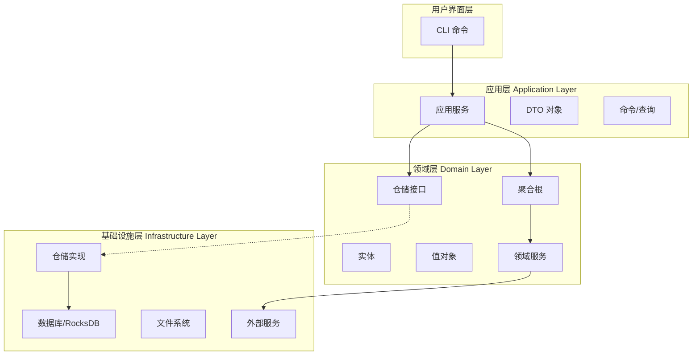
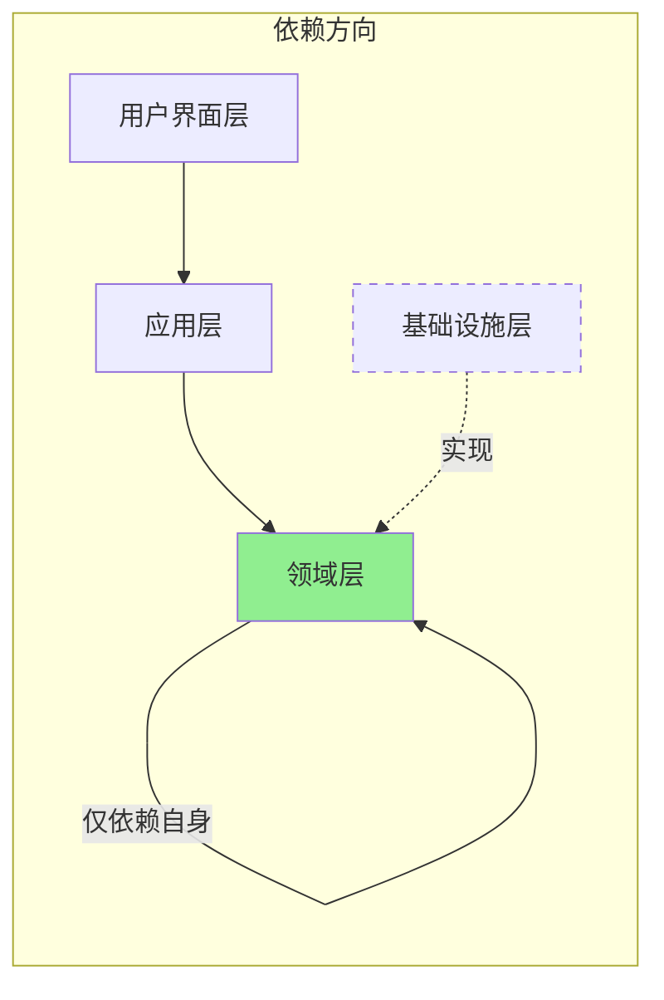
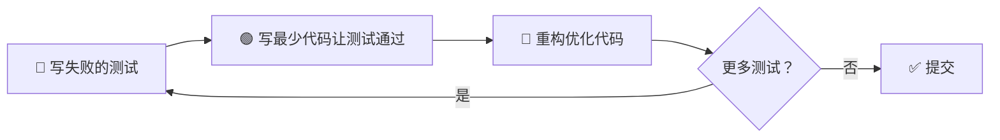
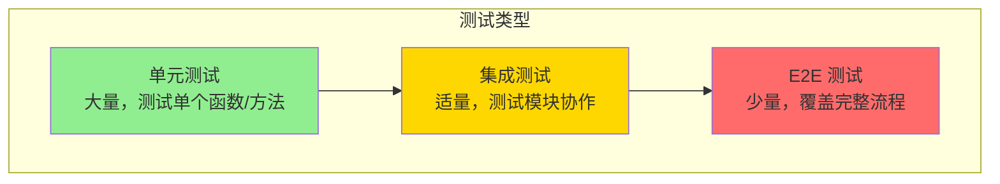
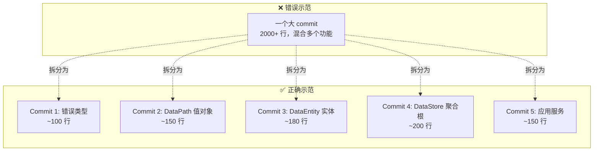
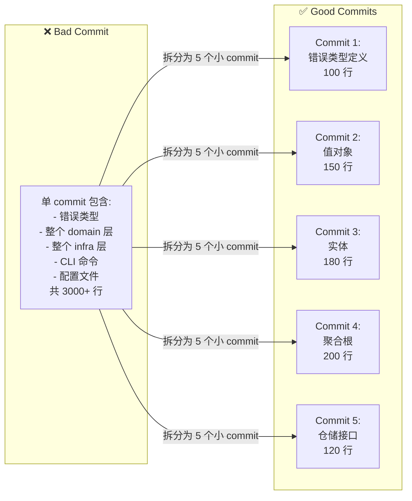

# RustViking 贡献指南

## 🎯 核心理念

RustViking 采用 **领域驱动设计 (DDD)** 和 **测试驱动开发 (TDD)** 作为核心开发方法论，确保代码质量、可维护性和可扩展性。

---

## 📐 架构原则：DDD

### 分层架构



### 领域模型示例

```rust
// ==================== 领域层 (domain/) ====================

/// 值对象 - 不可变，无业务 ID
#[derive(Debug, Clone, PartialEq)]
pub struct DataPath {
    raw: String,
}

impl DataPath {
    pub fn new(path: &str) -> Result<Self, DomainError> {
        if path.is_empty() {
            return Err(DomainError::InvalidPath("路径不能为空".into()));
        }
        if !path.starts_with('/') {
            return Err(DomainError::InvalidPath("必须以/开头".into()));
        }
        Ok(Self { raw: path.to_string() })
    }
    
    pub fn as_str(&self) -> &str {
        &self.raw
    }
}

/// 实体 - 有唯一标识
#[derive(Debug, Clone, PartialEq)]
pub struct DataEntity {
    id: Ulid,
    path: DataPath,
    metadata: Metadata,
}

/// 聚合根 - 事务边界
pub struct DataStore {
    id: StoreId,
    root_path: DataPath,
    entities: Vec<DataEntity>,
}

impl DataStore {
    pub fn create(id: StoreId, root: &str) -> Result<Self, DomainError> {
        // 业务规则验证
        Ok(Self {
            id,
            root_path: DataPath::new(root)?,
            entities: Vec::new(),
        })
    }
    
    pub fn add_entity(&mut self, entity: DataEntity) -> Result<(), DomainError> {
        // 不变量：路径必须在 root 下
        if !entity.path.as_str().starts_with(self.root_path.as_str()) {
            return Err(DomainError::PathOutOfBound);
        }
        self.entities.push(entity);
        Ok(())
    }
}

/// 领域服务 - 跨聚合操作
pub trait VectorComputeService: Send + Sync {
    fn compute_distance(&self, a: &[f32], b: &[f32]) -> f32;
    fn batch_compute(&self, vectors: &[Vec<f32>]) -> Vec<f32>;
}

/// 仓储接口 - 定义在领域层
pub trait DataStoreRepository: Send + Sync {
    fn get(&self, id: StoreId) -> Option<DataStore>;
    fn save(&self, store: &DataStore) -> Result<()>;
    fn delete(&self, id: StoreId) -> Result<()>;
}
```

```rust
// ==================== 应用层 (application/) ====================

/// 命令对象
#[derive(Debug)]
pub struct CreateDataStoreCommand {
    pub id: String,
    pub root_path: String,
}

/// 查询对象
#[derive(Debug)]
pub struct GetDataStoreQuery {
    pub id: String,
}

/// DTO - 数据传输对象
#[derive(Debug, Serialize, Deserialize)]
pub struct DataStoreDto {
    pub id: String,
    pub root_path: String,
    pub entity_count: usize,
}

/// 应用服务 - 协调领域对象
pub struct DataStoreAppService {
    repo: Arc<dyn DataStoreRepository>,
}

impl DataStoreAppService {
    pub fn new(repo: Arc<dyn DataStoreRepository>) -> Self {
        Self { repo }
    }
    
    pub fn create_store(&self, cmd: CreateDataStoreCommand) -> Result<DataStoreDto> {
        // 1. 参数验证
        let id = StoreId::parse(&cmd.id)?;
        
        // 2. 调用领域层
        let store = DataStore::create(id, &cmd.root_path)?;
        
        // 3. 持久化
        self.repo.save(&store)?;
        
        // 4. 返回 DTO
        Ok(DataStoreDto {
            id: store.id.to_string(),
            root_path: store.root_path.as_str().to_string(),
            entity_count: store.entities.len(),
        })
    }
}
```

```rust
// ==================== 基础设施层 (infrastructure/) ====================

/// 仓储实现
pub struct RocksDbDataStoreRepository {
    db: Arc<RocksDB>,
}

impl DataStoreRepository for RocksDbDataStoreRepository {
    fn get(&self, id: StoreId) -> Option<DataStore> {
        let key = format!("store:{}", id);
        let data = self.db.get(key)?;
        serde_json::from_slice(&data).ok()
    }
    
    fn save(&self, store: &DataStore) -> Result<()> {
        let key = format!("store:{}", store.id);
        let data = serde_json::to_vec(store)?;
        self.db.put(key, data)?;
        Ok(())
    }
}

/// 领域服务实现（SIMD 优化）
pub struct FaerVectorService {
    engine: MatrixEngine,
}

impl VectorComputeService for FaerVectorService {
    fn compute_distance(&self, a: &[f32], b: &[f32]) -> f32 {
        // 使用 faer SIMD 加速
        let vec_a = self.engine.vec_from_slice(a);
        let vec_b = self.engine.vec_from_slice(b);
        (&vec_a - &vec_b).norm_l2()
    }
}
```

### 依赖规则



**铁律：**
- ✅ 领域层 **零依赖** 于基础设施层
- ✅ 依赖倒置：基础设施依赖领域定义的接口
- ✅ 单向依赖：UI → App → Domain
- ❌ 禁止跨层调用（如 UI 直接调用 Infra）
- ❌ 禁止循环依赖

---

## 🧪 开发流程：TDD

### 红 - 绿 - 重构循环



### 测试金字塔



**比例建议：**
- 单元测试：70%+（快速、隔离、覆盖所有边界条件）
- 集成测试：20%（模块间协作、接口契约）
- E2E 测试：10%（CLI/API 完整流程）

### 测试分类与命名

```rust
// ==================== 单元测试 (tests/unit/) ====================

#[cfg(test)]
mod data_path_tests {
    use super::*;
    
    #[test]
    fn test_valid_path_creation() {
        // Given
        let path_str = "/data/vectors";
        
        // When
        let path = DataPath::new(path_str).unwrap();
        
        // Then
        assert_eq!(path.as_str(), "/data/vectors");
    }
    
    #[test]
    fn test_invalid_empty_path() {
        // Given
        let empty_path = "";
        
        // When/Then
        let result = DataPath::new(empty_path);
        assert!(result.is_err());
        assert_eq!(result.unwrap_err().to_string(), "路径不能为空");
    }
    
    #[test]
    fn test_invalid_no_leading_slash() {
        // Given
        let bad_path = "data/vectors";
        
        // When/Then
        let result = DataPath::new(bad_path);
        assert!(result.is_err());
        assert_eq!(result.unwrap_err().to_string(), "必须以/开头");
    }
}

// ==================== 集成测试 (tests/integration/) ====================

mod datastore_repository_tests {
    use tempfile::TempDir;
    
    #[test]
    fn test_rocksdb_repository_crud() {
        // Given
        let temp_dir = TempDir::new().unwrap();
        let repo = create_test_repository(temp_dir.path());
        let store = create_test_datastore();
        
        // When: Save
        repo.save(&store).unwrap();
        
        // Then: Get
        let retrieved = repo.get(store.id).unwrap();
        assert_eq!(retrieved.id, store.id);
        
        // When: Delete
        repo.delete(store.id).unwrap();
        
        // Then: Verify deleted
        assert!(repo.get(store.id).is_none());
    }
}

// ==================== E2E 测试 (tests/e2e/) ====================

#[test]
fn test_cli_create_and_query() {
    // Given
    let temp_dir = setup_test_environment();
    
    // When: Create via CLI
    let output = std::process::Command::new("rustviking")
        .args(&["kv", "set", "--key", "test-key", "--value", "test-value"])
        .output()
        .expect("Failed to execute command");
    
    // Then: Verify success
    assert!(output.status.success());
    
    // When: Query via CLI
    let output = std::process::Command::new("rustviking")
        .args(&["kv", "get", "--key", "test-key"])
        .output()
        .expect("Failed to execute command");
    
    // Then: Verify output
    assert!(output.status.success());
    let stdout = String::from_utf8(output.stdout).unwrap();
    assert!(stdout.contains("test-value"));
}
```

### TDD 开发步骤

#### 步骤 1：写测试（红）

```rust
// 1. 先写测试：tests/unit/domain/data_path.rs
#[test]
fn test_data_path_validation() {
    // 测试所有边界条件
    assert!(DataPath::new("/valid").is_ok());
    assert!(DataPath::new("").is_err());
    assert!(DataPath::new("no-slash").is_err());
    assert!(DataPath::new("/double//slash").is_err());
}
```

**此时编译失败**（因为 `DataPath` 还未实现）

#### 步骤 2：写最少实现（绿）

```rust
// 2. 实现刚好能让测试通过的代码
pub struct DataPath { raw: String }

impl DataPath {
    pub fn new(path: &str) -> Result<Self, DomainError> {
        if path.is_empty() || !path.starts_with('/') {
            return Err(DomainError::InvalidPath("无效".into()));
        }
        Ok(Self { raw: path.to_string() })
    }
}
```

**测试通过** ✅

#### 步骤 3：重构

```rust
// 3. 优化代码结构，添加更精确的错误信息
impl DataPath {
    pub fn new(path: &str) -> Result<Self, DomainError> {
        if path.is_empty() {
            return Err(DomainError::InvalidPath("路径不能为空".into()));
        }
        if !path.starts_with('/') {
            return Err(DomainError::InvalidPath("必须以/开头".into()));
        }
        if path.contains("//") {
            return Err(DomainError::InvalidPath("不能有连续斜杠".into()));
        }
        Ok(Self { raw: path.to_string() })
    }
}
```

**测试仍然通过** ✅

#### 步骤 4：提交

```bash
git add src/domain/data_path.rs tests/unit/domain/data_path.rs
git commit -m "feat(domain): 实现 DataPath 值对象及其验证逻辑

- 添加 DataPath 结构体封装路径字符串
- 实现路径格式验证（非空、前导斜杠、连续斜杠）
- 添加完整的单元测试覆盖边界条件
- 提供清晰的错误消息

TDD cycle: red-green-refactor"
```

---

## 📝 Commit 规范

### Commit 原子性原则

**每个 commit 应该是：**
- ✅ **原子的**：单独编译、测试通过
- ✅ **小的**：建议 < 200 行变更
- ✅ **可回滚的**：不影响其他功能
- ✅ **有意义的**：完成一个明确的子任务

### Commit 大小控制



### 好的 vs 坏的 Commit



### Commit Message 格式

遵循 [Conventional Commits](https://www.conventionalcommits.org/) 规范：

```
<type>(<scope>): <subject>

<body>

<footer>
```

#### Type（必需）

| Type | 说明 | 示例 |
|------|------|------|
| `feat` | 新功能 | `feat(storage): 添加 RocksDB 存储后端` |
| `fix` | Bug 修复 | `fix(cli): 修复路径解析错误` |
| `docs` | 文档更新 | `docs: 更新 API 文档` |
| `style` | 格式调整（不影响功能） | `style: 格式化代码` |
| `refactor` | 重构（非新功能） | `refactor(domain): 提取公共验证逻辑` |
| `perf` | 性能优化 | `perf(simd): 使用 faer 加速向量计算` |
| `test` | 测试相关 | `test: 添加 DataPath 边界测试` |
| `chore` | 构建/工具/配置 | `chore: 更新 Cargo.toml 依赖` |

#### Scope（可选）

标识影响的模块：
- `domain` - 领域层
- `application` - 应用层
- `infrastructure` - 基础设施层
- `cli` - CLI 命令
- `storage` - 存储模块
- `compute` - 计算模块
- `config` - 配置模块

#### Subject（必需）

- 使用祈使句："add" 而非 "added" 或 "adds"
- 首字母小写
- 不超 50 字符
- 不加句号

#### Body（可选）

- **What**：做了什么改动
- **Why**：为什么这么做
- **How**：如何实现的

#### Footer（可选）

- 关联 Issue：`Closes #123`
- Breaking Changes: `BREAKING CHANGE: ...`

### Commit 示例

#### 示例 1：新功能

```bash
feat(domain): 实现 DataPath 值对象

- 添加 DataPath 结构体封装原始路径字符串
- 实现路径格式验证（非空、前导斜杠、连续斜杠）
- 提供 AsRef<String> 用于安全访问内部字符串

动机：
- 防止无效路径在系统中传播
- 集中验证逻辑，避免重复代码

测试：
- 添加有效路径创建测试
- 添加无效路径边界测试（空字符串、无前导斜杠）

TDD cycle: red-green-refactor
```

#### 示例 2：Bug 修复

```bash
fix(storage): 修复 RocksDB 并发写入竞态条件

问题：
- 多线程同时写入同一 key 时可能丢失数据
- 原因：未使用批量写入原子性保证

解决方案：
- 使用 WriteBatch 进行原子写入
- 添加互斥锁保护并发写入

测试：
- 添加并发写入压力测试
- 验证 1000 次并发写入无数据丢失

Closes #45
```

#### 示例 3：重构

```bash
refactor(domain): 提取路径验证公共逻辑

改动：
- 创建 PathValidator trait
- 将 DataPath/DataEntity 的验证逻辑统一
- 减少代码重复约 40 行

影响：
- 无 API 变更
- 性能无影响

测试：
- 现有测试全部通过
```

#### 示例 4：性能优化

```bash
perf(compute): 使用 faer SIMD 加速 L2 距离计算

基准测试：
- 原生实现：45ms (1000 次 768 维向量距离计算)
- faer SIMD: 28ms (提升 38%)

实现：
- 替换手动循环为 faer 矩阵运算
- 利用 AVX2 指令集自动向量化

注意：
- 添加 faer 0.20 依赖
- 需要 CPU 支持 AVX2（现代 CPU 均支持）
```

---

## 🔄 完整开发工作流

### 1. 接受任务

```markdown
任务：实现数据存储功能

分解：
1. 定义领域模型（值对象、实体、聚合根）
2. 定义仓储接口
3. 实现 RocksDB 仓储
4. 实现应用服务
5. 实现 CLI 命令
```

### 2. TDD 循环开始

#### Cycle 1: DataPath 值对象

```bash
# 步骤 1: 写测试
# 编辑：tests/unit/domain/data_path.rs
#[test]
fn test_valid_path() { ... }

# 步骤 2: 运行测试（失败）
cargo test --lib data_path
# 🔴 FAILED

# 步骤 3: 实现功能
# 编辑：src/domain/data_path.rs
pub struct DataPath { ... }

# 步骤 4: 运行测试（通过）
cargo test --lib data_path
# 🟢 PASSED

# 步骤 5: 重构
# 优化代码结构

# 步骤 6: 提交
git add src/domain/data_path.rs tests/unit/domain/data_path.rs
git commit -m "feat(domain): 实现 DataPath 值对象

- 封装路径字符串并提供格式验证
- 支持 AsRef<String> 安全访问
- 完整的单元测试覆盖

TDD cycle: red-green-refactor"
```

#### Cycle 2: DataEntity 实体

```bash
# 重复 TDD 循环
# ...
git commit -m "feat(domain): 实现 DataEntity 实体

- 添加 Ulid 标识符
- 组合 DataPath 和 Metadata
- 实现不变量验证

Depends-on: DataPath"
```

### 3. 集成测试

```bash
# 完成所有单元测试后，编写集成测试
# 编辑：tests/integration/repository_tests.rs

#[test]
fn test_repository_crud() {
    // 测试完整的 CRUD 流程
}

# 运行集成测试
cargo test --test integration
```

### 4. 手动验证

```bash
# 构建并测试 CLI
cargo build --bin rustviking
./target/debug/rustviking kv set --key test --value hello
./target/debug/rustviking kv get --key test
```

### 5. 最终检查

```bash
# 运行所有测试
cargo test --workspace

# 代码质量检查
cargo clippy --workspace --all-targets -- -D warnings

# 格式化检查
cargo fmt --all --check

# 基准测试（可选）
cargo bench --bench compute_benchmark
```

### 6. 创建 PR

```markdown
## PR: 实现数据存储核心功能

### 变更列表
- feat(domain): DataPath, DataEntity, DataStore
- feat(infrastructure): RocksDB 仓储实现
- feat(application): 应用服务
- feat(cli): store create/list 命令

### 测试覆盖
- 单元测试：45 个，覆盖率 92%
- 集成测试：8 个，覆盖 CRUD 流程
- E2E 测试：3 个，覆盖 CLI 完整流程

### 基准测试
- RocksDB 写入：12,000 ops/sec
- RocksDB 读取：25,000 ops/sec

### 检查清单
✅ 所有测试通过
✅ Clippy 无警告
✅ 代码已格式化
✅ 文档已更新
✅ 无 Breaking Changes
```

---

## 📊 代码审查清单

### DDD 检查

- [ ] 领域层是否零依赖基础设施？
- [ ] 是否正确使用值对象（不可变、无 ID）？
- [ ] 是否正确识别实体（有唯一 ID）？
- [ ] 聚合根是否维护了不变量？
- [ ] 仓储接口是否定义在领域层？
- [ ] 应用服务是否仅协调而不包含业务逻辑？

### TDD 检查

- [ ] 是否先写测试再写实现？
- [ ] 单元测试覆盖率是否 > 90%？
- [ ] 是否覆盖了所有边界条件？
- [ ] 集成测试是否验证了模块协作？
- [ ] 测试是否独立、可重复？

### Commit 检查

- [ ] 每个 commit 是否 < 200 行？
- [ ] 每个 commit 是否可单独编译测试？
- [ ] Commit message 是否符合规范？
- [ ] 是否避免了无关的空格修改？
- [ ] 是否有清晰的业务价值描述？

### 代码质量检查

- [ ] `cargo test` 全部通过
- [ ] `cargo clippy` 无警告
- [ ] `cargo fmt` 已格式化
- [ ] 无 TODO/FIXME 标记（应移到 issue tracker）
- [ ] 公共 API 有文档注释

---

## 🛠️ 实用工具

### Git 别名配置

```bash
# ~/.zshrc 或 ~/.bashrc

# 查看精简日志
alias gitlog='git log --oneline --graph --decorate'

# 查看某个文件的提交历史
alias gitfile='git log --oneline --follow'

# 查看某行的提交历史
alias gitline='git blame'

# 暂存部分变更
alias gitp='git add -p'

# 查看当前状态
alias gits='git status -sb'
```

### Cargo 命令

```bash
# 运行特定测试
cargo test --lib data_path

# 运行集成测试
cargo test --test integration

# 运行 E2E 测试
cargo test --test e2e

# 生成测试覆盖率报告
cargo tarpaulin --out Html

# 性能基准测试
cargo bench --bench storage_bench

# 检查代码质量
cargo clippy --workspace --all-targets -- -D warnings
```

---

## 📚 参考资源

- [Domain-Driven Design Distilled](https://www.amazon.com/Domain-Driven-Design-Distilled-Vaughn-Vernon/dp/0134434420)
- [Test-Driven Development with Rust](https://www.amazon.com/Test-Driven-Development-Rust-Zedshaw/dp/1788396049)
- [Conventional Commits](https://www.conventionalcommits.org/)
- [Clean Architecture](https://blog.cleancoder.com/clean-architecture/)

---

## 🤝 社区准则

1. **尊重他人**：建设性反馈，对事不对人
2. **小步快跑**：宁可多提交，不要大爆炸
3. **测试先行**：没有测试的功能是不存在的
4. **文档同步**：代码变更时更新文档
5. **持续集成**：每次提交都运行 CI 检查

---

**最后提醒：**

> 💡 **好的代码是演进而来的，不是设计的。**
> 
> 通过 TDD 的小步迭代，我们可以演化出高质量的代码。
> 
> 通过 DDD 的严格分层，我们可以保持架构的清晰。
> 
> 通过原子化的提交，我们可以安全地协作和回滚。
> 
> **让我们一起打造 RustViking！** 🚀
