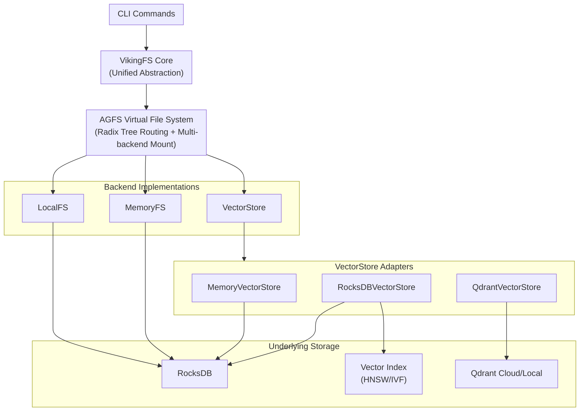

# RustViking

> OpenViking Core in Rust - A high-performance, CLI-first AI Agent memory infrastructure.

<p align="center">
  <a href="https://github.com/SpellingDragon/rustviking/actions">
    
  </a>
  <a href="LICENSE">
    
  </a>
  <a href="https://www.rust-lang.org">
    
  </a>
</p>

---

## Overview

RustViking is a Rust implementation of core storage and indexing concepts from [OpenViking](https://github.com/volcengine/OpenViking). It provides a high-performance foundation for AI Agent memory systems with a CLI-first design philosophy.

### Core Features

**Storage Layer**
- AGFS Virtual File System with `viking://` URI scheme and radix tree routing
- RocksDB-backed persistent key-value storage with batch operations
- Async VectorStore abstraction supporting Memory, RocksDB, and Qdrant backends

**Index Layer**
- HNSW and IVF-PQ vector indexes with SIMD acceleration
- L0/L1/L2 hierarchical context indexing for multi-level retrieval
- RocksDB persistence for both HNSW and IVF indexes

**Performance**
- ARM NEON / x86 AVX2/FMA SIMD acceleration (4-8x speedup for vector operations)
- Pure Rust implementation with zero CGO dependencies
- Built-in CLI benchmark suite for KV, vector search, and bitmap operations

---

## Quick Start

### Requirements

- Rust 1.82 or higher
- macOS 10.15+ / Linux (Ubuntu 20.04+) / Windows (WSL2)

### Build

```bash
git clone https://github.com/SpellingDragon/rustviking.git
cd rustviking

# Debug build (development)
cargo build

# Release build (production, recommended)
cargo build --release
```

### Basic Usage

```bash
# VikingFS commands
./target/release/rustviking mkdir viking://resources/project/docs
./target/release/rustviking write viking://resources/doc.md -d "Hello, RustViking!"
./target/release/rustviking read viking://resources/doc.md
./target/release/rustviking ls viking://resources/

# L0/L1 summary commands
./target/release/rustviking abstract viking://resources/doc.md
./target/release/rustviking overview viking://resources/
./target/release/rustviking commit viking://resources/

# Search and index commands
./target/release/rustviking find "authentication" -k 10
./target/release/rustviking kv put -k "user:1:name" -v "Alice"
./target/release/rustviking kv batch -f - < batch_ops.json

# Benchmark commands
./target/release/rustviking bench kv-write -c 10000
./target/release/rustviking bench vector-search -c 1000
```

---

## Architecture



### Module Structure

```
src/
├── agfs/              # AGFS Virtual File System
├── vikingfs/          # VikingFS Core (unified abstraction)
├── index/             # Vector Index (HNSW/IVF with persistence)
├── storage/           # KV Storage (RocksDB)
├── vector_store/      # Vector Store abstraction
│   ├── traits.rs      # Async VectorStore trait
│   ├── memory.rs      # In-memory backend
│   ├── rocks.rs       # RocksDB backend
│   └── qdrant.rs      # Qdrant cloud backend
├── embedding/         # Embedding Providers
├── compute/           # SIMD-optimized Distance Computations
│   ├── simd.rs        # ARM NEON / x86 AVX2/FMA acceleration
│   └── distance.rs    # Distance computation kernels
├── cli/               # CLI Commands
├── config/            # Configuration
└── error.rs           # Error Types
```

---

## CLI Commands

### VikingFS Commands

| Command | Description | Example |
|---------|-------------|---------|
| `read` | Read file content | `rustviking read viking://resources/doc.md` |
| `write` | Write file | `rustviking write viking://resources/doc.md "content"` |
| `mkdir` | Create directory | `rustviking mkdir viking://resources/docs` |
| `rm` | Remove file/directory | `rustviking rm viking://resources/doc.md` |
| `mv` | Move/rename | `rustviking mv viking://old.md viking://new.md` |
| `ls` | List directory | `rustviking ls viking://resources/` |
| `stat` | Get file info | `rustviking stat viking://resources/doc.md` |
| `abstract` | Read/generate L0 abstract | `rustviking abstract viking://resources/doc.md` |
| `overview` | Read/generate L1 overview | `rustviking overview viking://resources/` |
| `detail` | Read L2 full content | `rustviking detail viking://resources/doc.md` |
| `find` | Search content | `rustviking find "query" --k 10` |
| `commit` | Trigger aggregation | `rustviking commit viking://resources/` |

### Key-Value Commands

| Command | Description | Example |
|---------|-------------|---------|
| `kv get` | Get value | `rustviking kv get -k "user:1:name"` |
| `kv put` | Set key-value | `rustviking kv put -k "user:1:name" -v "Alice"` |
| `kv del` | Delete key | `rustviking kv del -k "user:1:name"` |
| `kv scan` | Prefix scan | `rustviking kv scan --prefix "user:" --limit 100` |
| `kv batch` | Batch operations | `rustviking kv batch -f ops.json` |

### Benchmark Commands

| Subcommand | Description | Example |
|------------|-------------|---------|
| `kv-write` | KV write throughput | `rustviking bench kv-write -c 10000` |
| `kv-read` | KV read throughput | `rustviking bench kv-read -c 10000` |
| `vector-search` | Vector search latency | `rustviking bench vector-search -c 1000` |
| `bitmap-ops` | Bitmap operations | `rustviking bench bitmap-ops -c 10000` |

---

## Configuration

Create a `config.toml` file:

```toml
[storage]
path = "./data/rustviking"
create_if_missing = true

[vector]
dimension = 768
index_type = "ivf_pq"

# Vector Store Backend: "memory", "rocksdb", or "qdrant"
[vector_store]
plugin = "rocksdb"

[vector_store.rocksdb]
path = "./data/rustviking/vector_store"

# Qdrant Configuration (when plugin = "qdrant")
[vector_store.qdrant]
url = "http://localhost:6334"
collection_name = "rustviking"

[embedding]
plugin = "mock"

[summary]
provider = "heuristic"
```

See [config.toml.example](config.toml.example) for full configuration options.

### Vector Store Backends

| Backend | Plugin Name | Use Case |
|---------|-------------|----------|
| Memory | `memory` | Development, testing, ephemeral data |
| RocksDB | `rocksdb` | Local production, embedded deployments |
| Qdrant | `qdrant` | Cloud-native, distributed, high-scale |

---

## Library Usage

```rust
use rustviking::vikingfs::VikingFS;
use rustviking::config::Config;

#[tokio::main]
async fn main() -> Result<()> {
    let config = Config::from_file("config.toml")?;
    let vikingfs = VikingFS::from_config(&config).await?;
    
    vikingfs.write("viking://resources/doc.md", "Hello, World!").await?;
    let content = vikingfs.read("viking://resources/doc.md").await?;
    
    let results = vikingfs.find("query", None, None, 10).await?;
    
    Ok(())
}
```

---

## Benchmarks

```bash
# Run all benchmarks
cargo bench

# Specific benchmarks
cargo bench --bench kv_bench
cargo bench --bench vector_bench
cargo bench --bench compute_bench
```

Performance targets:
- CLI command latency: < 5ms
- Vector search latency: < 10ms (P99)
- Single binary deployment, zero CGO dependencies

---

## Differences from OpenViking

[OpenViking](https://github.com/volcengine/OpenViking) is ByteDance's production-grade AI Agent context database. RustViking implements only the storage layer foundation without advanced features like intent analysis, session management, or LLM integration.

| Dimension | OpenViking | RustViking |
|-----------|-----------|------------|
| Language | Go + Python + C++ | Pure Rust |
| Interaction | HTTP/gRPC Service | CLI-first |
| Scope | Full Agent Platform | Storage Layer Foundation |
| Maturity | Production-grade | Experimental |

For production-grade AI Agent memory systems, we recommend using [OpenViking](https://github.com/volcengine/OpenViking) directly.

Key advantages of RustViking:
- Pure Rust implementation with no Python dependencies
- SIMD acceleration for vector operations
- CLI-first design optimized for command-line workflows
- Zero CGO dependencies for easy cross-compilation

---

## Contributing

All forms of contributions are welcome. Please read [CONTRIBUTING.md](CONTRIBUTING.md) for development setup and pull request guidelines.

---

## License

RustViking is licensed under [Apache-2.0](LICENSE).
