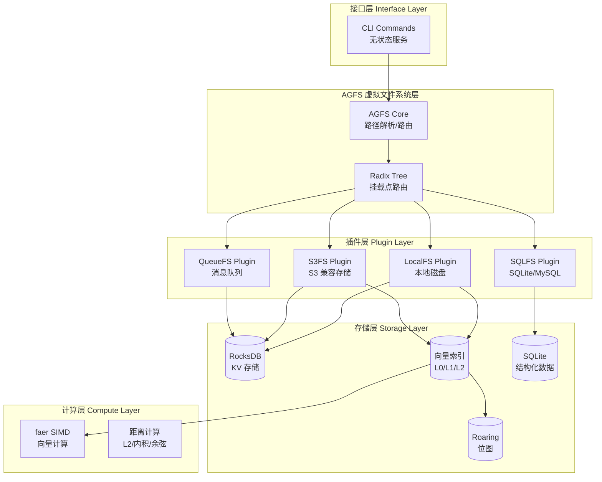

# RustViking

> **OpenViking Core in Rust** — 高性能、命令行优先的 AI Agent 记忆基础设施

<p align="center">
  <a href="https://github.com/SpellingDragon/rustviking/actions">
    
  </a>
  <a href="LICENSE">
    
  </a>
  <a href="https://www.rust-lang.org">
    
  </a>
</p>

---

## 功能亮点

| 特性 | 描述 |
|------|------|
| **AGFS 虚拟文件系统** | 创新的 "文件系统范式" 管理 AI Agent 记忆、资源和技能，统一通过 `viking://` URI 访问 |
| **分层向量索引 L0/L1/L2** | 三层上下文架构：L0 摘要层 (~100 tokens)、L1 概述层 (~2k tokens)、L2 详细内容层 |
| **SIMD 优化** | 基于 [faer](https://crates.io/crates/faer) 的自动向量化，高效的距离计算和矩阵运算 |
| **RocksDB KV 存储** | 生产级键值存储，支持前缀扫描、范围查询、批量操作 |
| **零 CGO 依赖** | 纯 Rust 实现，单二进制部署，无运行时 GC 停顿 |
| **命令行优先** | 无状态 CLI 设计，可被任何语言通过 Shell 调用 |

---

## 快速开始

### 环境要求

- **Rust**: 1.75 或更高版本
- **操作系统**: macOS 10.15+ / Linux (Ubuntu 20.04+) / Windows (WSL2)
- **内存**: 最少 4GB RAM，推荐 8GB+

### 编译

```bash
# 克隆仓库
git clone https://github.com/SpellingDragon/rustviking.git
cd rustviking

# Debug 模式（开发）
cargo build

# Release 模式（生产，推荐）
cargo build --release

# 编译产物
# Debug:   target/debug/rustviking
# Release: target/release/rustviking
```

### 基础使用

```bash
# 查看帮助
./target/release/rustviking --help

# 文件系统操作
./rustviking fs mkdir viking://resources/project/docs
./rustviking fs write viking://resources/doc.md --data "Hello, RustViking!"
./rustviking fs cat viking://resources/doc.md
./rustviking fs ls viking://resources/project/

# 键值存储操作
./rustviking kv put --key "user:1:name" --value "Alice"
./rustviking kv get --key "user:1:name"
./rustviking kv scan --prefix "user:1:" --limit 100

# 向量索引操作
./rustviking index insert --id 1 --vector 0.1,0.2,0.3,0.4 --level 2
./rustviking index search --query 0.1,0.2,0.3,0.4 --k 10
./rustviking index info
```

---

## 架构概览

RustViking 采用分层架构设计，核心组件包括：

- **接口层**: 无状态 CLI 命令，可选 gRPC/HTTP 服务
- **AGFS 层**: 虚拟文件系统核心，Radix Tree 路由，Viking URI 解析
- **插件层**: 多存储后端支持 (LocalFS, S3FS, SQLFS, QueueFS)
- **存储层**: RocksDB KV 存储、向量索引、Roaring 位图
- **计算层**: faer SIMD 向量计算、距离度量



---

## CLI 命令速查表

### 文件系统命令 (fs)

| 命令 | 描述 | 示例 |
|------|------|------|
| `fs mkdir` | 创建目录 | `rustviking fs mkdir viking://resources/project/docs` |
| `fs ls` | 列出目录 | `rustviking fs ls viking://resources/project/` |
| `fs cat` | 读取文件 | `rustviking fs cat viking://resources/doc.md` |
| `fs write` | 写入文件 | `rustviking fs write viking://resources/doc.md --data "..."` |
| `fs rm` | 删除文件/目录 | `rustviking fs rm viking://resources/doc.md` |
| `fs stat` | 获取文件信息 | `rustviking fs stat viking://resources/doc.md` |

### 键值存储命令 (kv)

| 命令 | 描述 | 示例 |
|------|------|------|
| `kv get` | 获取值 | `rustviking kv get --key "user:1:name"` |
| `kv put` | 设置键值 | `rustviking kv put --key "user:1:name" --value "Alice"` |
| `kv del` | 删除键 | `rustviking kv del --key "user:1:name"` |
| `kv scan` | 前缀扫描 | `rustviking kv scan --prefix "user:" --limit 100` |
| `kv batch` | 批量操作 | `rustviking kv batch --file ops.json` |

### 索引命令 (index)

| 命令 | 描述 | 示例 |
|------|------|------|
| `index insert` | 插入向量 | `rustviking index insert --id 1 --vector 0.1,0.2 --level 2` |
| `index search` | 向量搜索 | `rustviking index search --query 0.1,0.2 --k 10` |
| `index delete` | 删除向量 | `rustviking index delete --id 1` |
| `index info` | 索引信息 | `rustviking index info` |

---

## 配置说明

复制示例配置文件并进行自定义：

```bash
cp config.toml.example config.toml
```

关键配置项说明：

```toml
[storage]
path = "./data/rustviking"        # 数据存储根目录
max_open_files = 10000            # RocksDB 最大打开文件数
use_fsync = false                 # 是否启用 fsync

[vector]
dimension = 768                   # 向量维度
index_type = "ivf_pq"             # 索引类型: ivf_pq, hnsw

[vector.ivf_pq]
num_partitions = 256              # IVF 分区数量
num_sub_vectors = 16              # PQ 子向量数量
metric = "l2"                     # 距离度量: l2, cosine, dot

[logging]
level = "info"                    # 日志级别
format = "json"                   # 输出格式: json, pretty
```

完整配置选项请参考 [config.toml.example](config.toml.example)。

---

## 致谢 OpenViking

RustViking 的诞生，源于对 **[OpenViking](https://github.com/volcengine/OpenViking)** 深深的敬意与热爱。


| 维度 | OpenViking | RustViking |
|------|-----------|------------|
| **语言** | Go + Python + C++ | 纯 Rust |
| **交互方式** | HTTP/gRPC 服务 | **命令行优先** |
| **哲学** | 多语言协作 | 零外部 CGO 依赖 |
| **延迟** | 依赖运行时 GC | 无 GC，延迟可预测 |

再次特别感谢 OpenViking 团队的开源贡献，你们的工作为整个 AI Agent 领域树立了典范

---

## 贡献指引

欢迎所有形式的贡献！请阅读 [CONTRIBUTING.md](CONTRIBUTING.md) 了解如何：

- 提交 Issue 和 Feature Request
- 设置开发环境
- 提交 Pull Request
- 遵循代码规范

## License

RustViking 采用 [Apache-2.0](LICENSE) 许可证开源。

```
Copyright 2026 RustViking Contributors

Licensed under the Apache License, Version 2.0 (the "License");
you may not use this file except in compliance with the License.
You may obtain a copy of the License at

    http://www.apache.org/licenses/LICENSE-2.0
```
