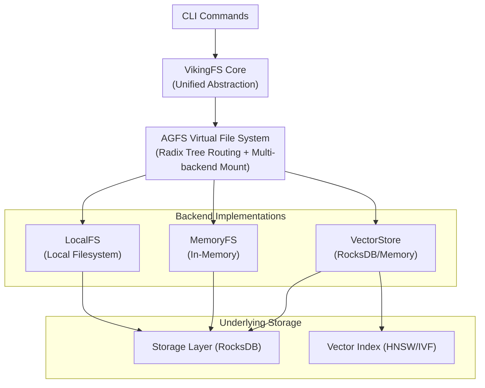

# RustViking

> OpenViking Core in Rust — A high-performance, CLI-first AI Agent memory infrastructure.

<p align="center">
  <a href="https://github.com/SpellingDragon/rustviking/actions">
    
  </a>
  <a href="LICENSE">
    
  </a>
  <a href="https://www.rust-lang.org">
    
  </a>
</p>

---

## Project Status

**Experimental Project** — This is a Rust implementation exploration of OpenViking core concepts, currently in active development.

### Feature Matrix

| Feature | Status | Description |
|---------|--------|-------------|
| **AGFS Virtual File System** | ✅ Ready | Unified filesystem abstraction via `viking://` URI |
| **RocksDB KV Storage** | ✅ Production | Persistent key-value storage with RocksDB |
| **HNSW Vector Index** | ✅ Persistent | HNSW implementation with RocksDB persistence |
| **IVF Vector Index** | ✅ Persistent | IVF clustering index with RocksDB persistence |
| **L0/L1 Summary Layer** | ✅ Heuristic | Automatic abstract/overview generation |
| **VikingFS Core** | ✅ Ready | Unified abstraction layer for AGFS and Vector Store |
| **VikingFS CLI** | ✅ 12 Commands | read/write/mkdir/rm/mv/ls/stat/abstract/overview/detail/find/commit |
| **OpenAI Embedding** | ✅ Ready | Compatible with OpenAI API embedding services |
| **S3FS Plugin** | ❌ Missing | S3-compatible storage backend |
| **SQLFS Plugin** | ❌ Missing | SQL database storage backend |
| **HTTP/gRPC Service** | ❌ Missing | REST API and gRPC interface |

### Differences from OpenViking

[OpenViking](https://github.com/volcengine/OpenViking) is ByteDance's production-grade AI Agent context database, featuring:
- Intent analysis
- Hierarchical retrieval and reranking
- Session management and memory extraction
- Document parsing and LLM integration

**RustViking currently implements only the storage layer foundation** of OpenViking, without the advanced features above. For production-grade AI Agent memory systems, we recommend using [OpenViking](https://github.com/volcengine/OpenViking) directly.

---

## Quick Start

### Requirements

- **Rust**: 1.82 or higher
- **OS**: macOS 10.15+ / Linux (Ubuntu 20.04+) / Windows (WSL2)

### Build

```bash
# Clone repository
git clone https://github.com/SpellingDragon/rustviking.git
cd rustviking

# Debug build (development)
cargo build

# Release build (production, recommended)
cargo build --release
```

### Basic Usage

```bash
# Show help
./target/release/rustviking --help

# VikingFS commands (top-level)
./rustviking mkdir viking://resources/project/docs
./rustviking write viking://resources/doc.md "Hello, RustViking!"
./rustviking read viking://resources/doc.md
./rustviking ls viking://resources/
./rustviking stat viking://resources/doc.md

# L0/L1 Summary commands
./rustviking abstract viking://resources/doc.md    # Generate L0 abstract
./rustviking overview viking://resources/          # Generate L1 overview
./rustviking detail viking://resources/doc.md      # Read L2 full content
./rustviking commit viking://resources/            # Trigger summary aggregation

# Search commands
./rustviking find "authentication" --k 10          # Semantic search
./rustviking find --regex "oauth|jwt"              # Regex search

# Legacy commands
./rustviking kv put --key "user:1:name" --value "Alice"
./rustviking kv get --key "user:1:name"
./rustviking index insert --id 1 --vector 0.1,0.2,0.3,0.4 --level 2
./rustviking index search --query 0.1,0.2,0.3,0.4 --k 10
```

---

## Architecture



### Module Structure

```
src/
├── agfs/           # AGFS Virtual File System
├── vikingfs/       # VikingFS Core (unified abstraction)
├── index/          # Vector Index (HNSW/IVF with persistence)
├── storage/        # KV Storage (RocksDB)
├── vector_store/   # Vector Store abstraction
├── embedding/      # Embedding Providers
├── cli/            # CLI Commands
├── config/         # Configuration
└── error.rs        # Error Types (18 variants)
```

---

## CLI Commands

### VikingFS Commands (Top-Level)

| Command | Description | Example |
|---------|-------------|---------|
| `read` | Read file content | `rustviking read viking://resources/doc.md` |
| `write` | Write file | `rustviking write viking://resources/doc.md "content"` |
| `mkdir` | Create directory | `rustviking mkdir viking://resources/project/docs` |
| `rm` | Remove file/directory | `rustviking rm viking://resources/doc.md` |
| `mv` | Move/rename | `rustviking mv viking://old.md viking://new.md` |
| `ls` | List directory | `rustviking ls viking://resources/` |
| `stat` | Get file info | `rustviking stat viking://resources/doc.md` |
| `abstract` | Read/generate L0 abstract | `rustviking abstract viking://resources/doc.md` |
| `overview` | Read/generate L1 overview | `rustviking overview viking://resources/` |
| `detail` | Read L2 full content | `rustviking detail viking://resources/doc.md` |
| `find` | Search content | `rustviking find "query" --k 10` |
| `commit` | Trigger aggregation | `rustviking commit viking://resources/` |

### Legacy Commands

| Command | Description | Example |
|---------|-------------|---------|
| `kv get` | Get value | `rustviking kv get --key "user:1:name"` |
| `kv put` | Set key-value | `rustviking kv put --key "user:1:name" --value "Alice"` |
| `kv del` | Delete key | `rustviking kv del --key "user:1:name"` |
| `kv scan` | Prefix scan | `rustviking kv scan --prefix "user:" --limit 100` |
| `index insert` | Insert vector | `rustviking index insert --id 1 --vector 0.1,0.2 --level 2` |
| `index search` | Vector search | `rustviking index search --query 0.1,0.2 --k 10` |

---

## Configuration

Create a `config.toml` file:

```toml
[storage]
path = "./data/rustviking"
create_if_missing = true

[vector]
dimension = 768
index_type = "ivf_pq"

[vector_store]
plugin = "rocksdb"

[vector_store.rocksdb]
path = "./data/rustviking/vector_store"

[embedding]
plugin = "mock"

[summary]
provider = "heuristic"  # Options: "noop", "heuristic"
```

See [config.toml.example](config.toml.example) for full configuration options.

---

## As a Rust Library

```rust
use rustviking::vikingfs::VikingFS;
use rustviking::config::Config;

#[tokio::main]
async fn main() -> Result<()> {
    // Load configuration
    let config = Config::from_file("config.toml")?;
    
    // Initialize VikingFS
    let vikingfs = VikingFS::from_config(&config).await?;
    
    // Write file
    vikingfs.write("viking://resources/doc.md", "Hello, World!").await?;
    
    // Read file
    let content = vikingfs.read("viking://resources/doc.md").await?;
    println!("{}", content);
    
    // Generate abstract
    let abstract_text = vikingfs.abstract_("viking://resources/doc.md").await?;
    
    // Search
    let results = vikingfs.find("query", None, None, 10).await?;
    
    Ok(())
}
```

---

## Benchmarks

```bash
# Run all benchmarks
cargo bench

# KV benchmarks
cargo bench --bench kv_bench

# Vector benchmarks
cargo bench --bench vector_bench

# AGFS benchmarks
cargo bench --bench agfs_bench
```

Performance targets:
- CLI command latency: < 5ms
- Vector search latency: < 10ms (P99)
- Single binary deployment, zero CGO dependencies

---

## Tribute to OpenViking

RustViking was inspired by **[OpenViking](https://github.com/volcengine/OpenViking)**.

| Dimension | OpenViking | RustViking |
|-----------|-----------|------------|
| **Language** | Go + Python + C++ | Pure Rust |
| **Interaction** | HTTP/gRPC Service | **CLI-first** |
| **Scope** | Full Agent Platform | Storage Layer Foundation |
| **Maturity** | Production-grade | Experimental |

Special thanks to the OpenViking team for their open-source contribution!

---

## Contributing

All forms of contributions are welcome! Please read [CONTRIBUTING.md](CONTRIBUTING.md) for:

- Submitting Issues and Feature Requests
- Setting up development environment
- Submitting Pull Requests

---

## License

RustViking is licensed under [Apache-2.0](LICENSE).

---

*For Chinese documentation, see [concept.md](concept.md)*
