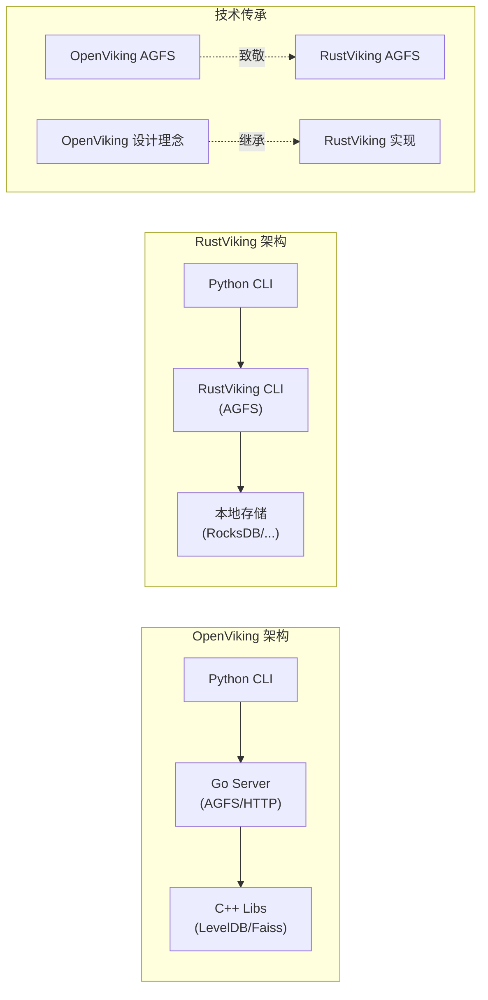
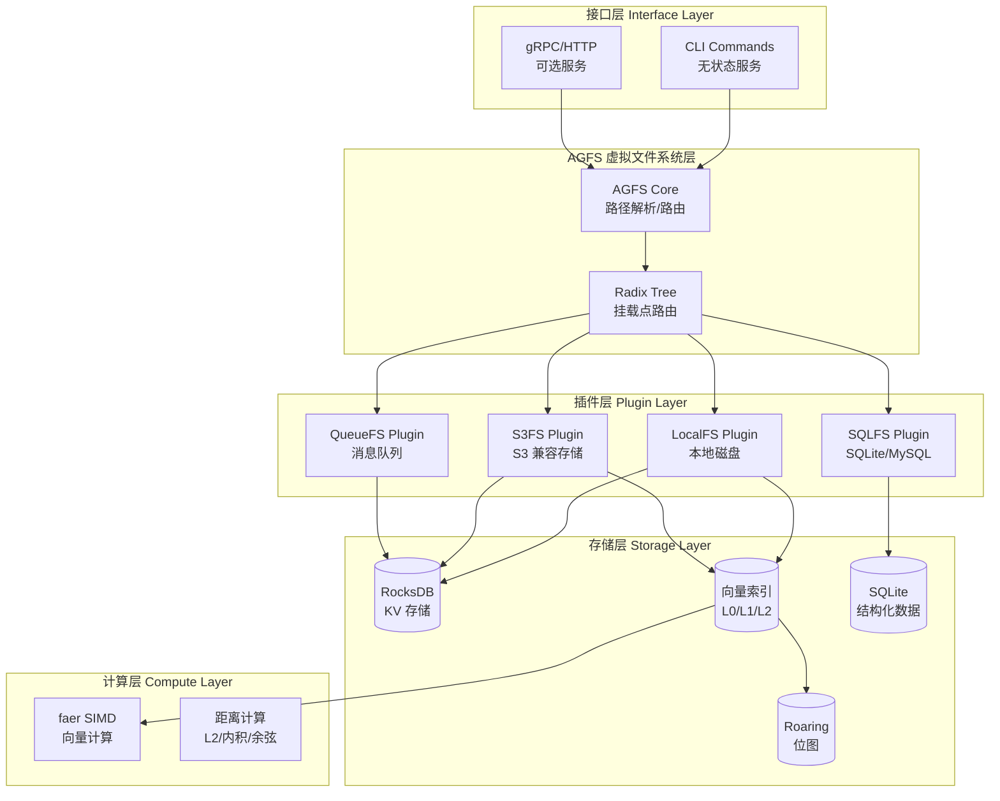
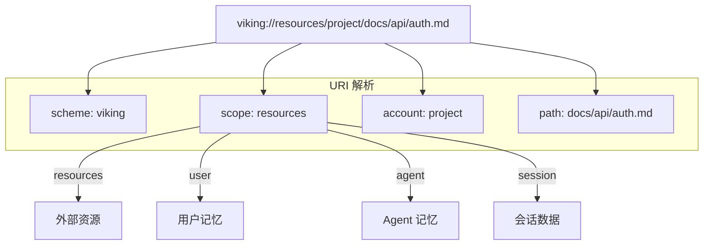
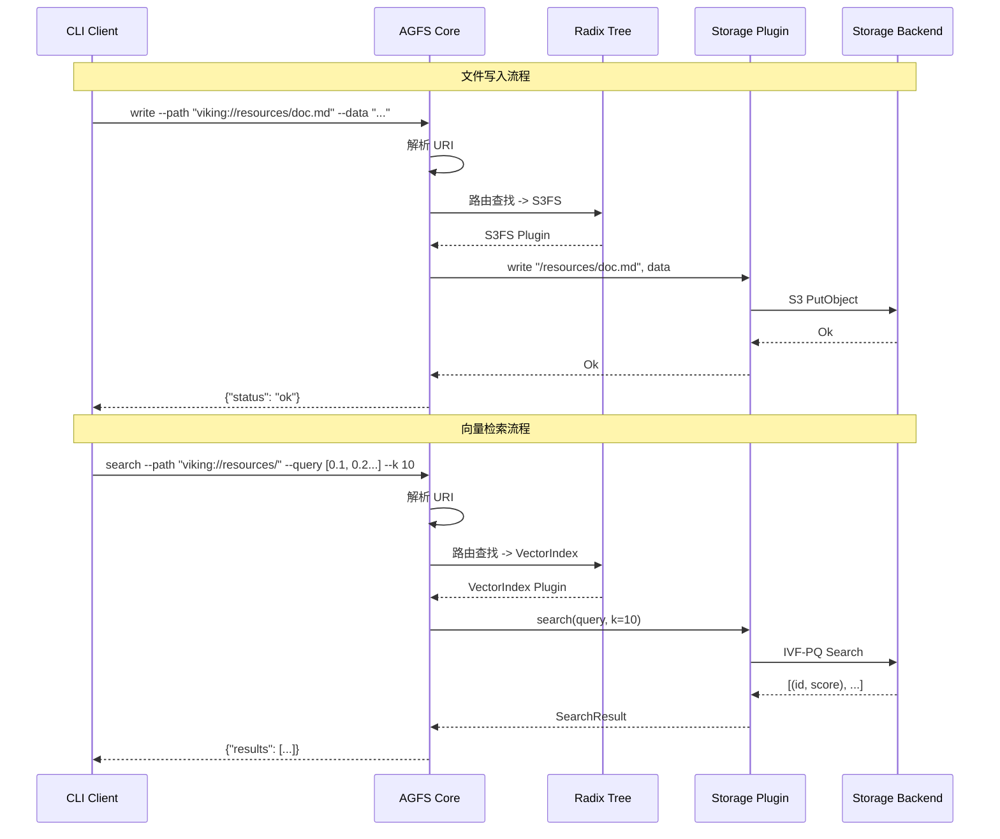
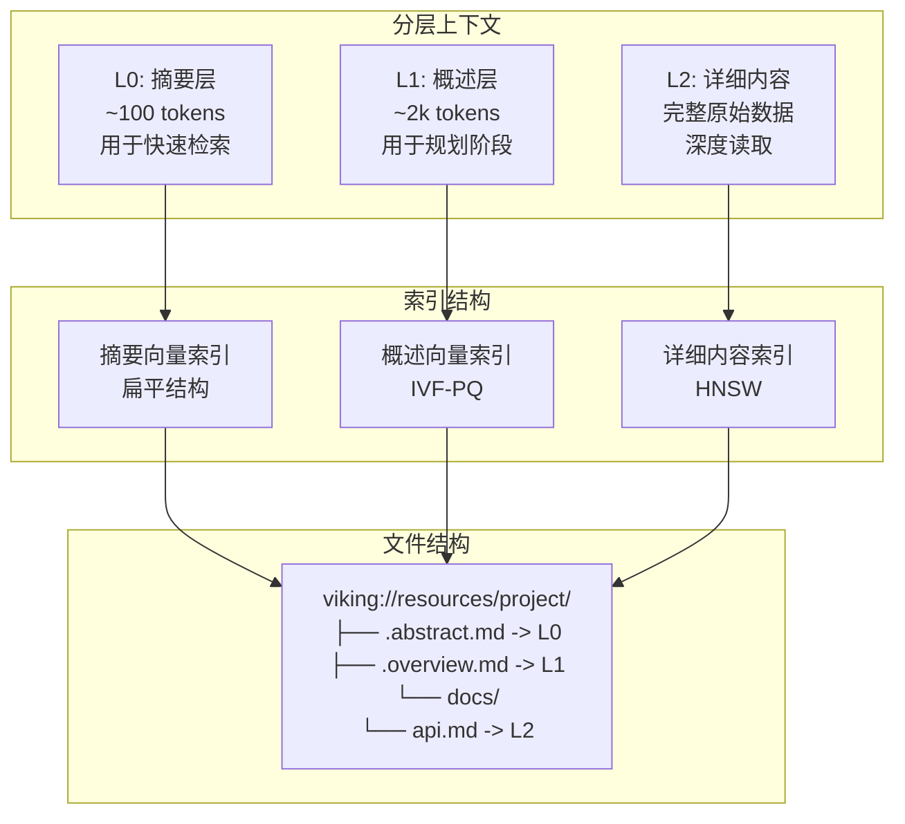

# RustViking 核心概念文档

## 目录

1. [致敬 OpenViking](#致敬-openviking)
2. [项目愿景与定位](#1-项目愿景与定位)
3. [技术选型分析](#2-技术选型分析)
4. [系统架构设计](#3-系统架构设计)
5. [AGFS 虚拟文件系统](#4-agfs-虚拟文件系统)
6. [存储层实现](#5-存储层实现)
7. [向量索引层实现](#6-向量索引层实现)
8. [CLI 命令设计](#7-cli-命令设计)
9. [本地编译、部署与运行](#9-本地编译部署与运行)
10. [技术决策与权衡](#10-技术决策与权衡)
11. [开发路线图](#11-开发路线图)

---

## 致敬 OpenViking

RustViking 的诞生，源于我们对 **OpenViking** 深深的敬意与热爱。

### OpenViking 的卓越之处

[OpenViking](https://github.com/volcengine/OpenViking) 是字节跳动内部 AI Agent 基础设施团队开源的杰作，代表了生产级 AI 记忆系统设计的最高水平。它：

- **首创"文件系统范式"**：以统一的方式管理 AI Agent 的记忆、资源和技能，这一设计理念至今仍是我们学习的标杆
- **稳定可靠的生产验证**：支撑着字节跳动内部大规模的 AI Agent 部署，经受住了真实业务的严苛考验
- **优雅的架构设计**：Go + Python + C++ 的多语言协作模式，在性能和开发效率之间取得了精妙的平衡

### RustViking 的定位

> *"站在巨人的肩膀上，我们希望用 Rust 语言为 OpenViking 的核心功能注入新的可能。"*

RustViking 不是对 OpenViking 的替代，而是一次**致敬性的技术创新**：

| 维度 | OpenViking | RustViking |
|------|-----------|------------|
| **语言** | Go + Python + C++ | 纯 Rust |
| **交互方式** | HTTP/gRPC 服务 | **命令行优先** |
| **哲学** | 多语言协作 | 零外部 CGO 依赖 |
| **延迟** | 依赖运行时 GC | 无 GC，延迟可预测 |
| **定位** | 完整 Agent 平台 | OpenViking Core 的 Rust CLI 实现 |

我们的目标是为那些希望在 Rust 生态中使用 OpenViking 核心能力（AGFS 虚拟文件系统、分层向量索引）的开发者提供一个**高性能、命令行优先、无状态调用**的解决方案。

### 致谢

特别感谢 OpenViking 团队的开源贡献，你们的工作为整个 AI Agent 领域树立了典范。RustViking 谨以本项目致敬！

---

### 1.1 项目背景

OpenViking 是一款专为 AI Agent 设计的上下文数据库，采用"文件系统范式"统一管理记忆、资源和技能。当前实现使用 Go + Python + C++ 多语言架构，其中：
- **Go 层**：AGFS 文件系统服务、HTTP API、插件系统
- **Python 层**：核心业务逻辑、VikingBot Agent、CLI
- **C++ 层**：LevelDB、Roaring Bitmap、KRL 向量计算

### 1.2 项目目标

RustViking 的目标是：**提供一个纯 Rust 实现的 OpenViking 核心功能，包含 AGFS 虚拟文件系统、多种存储后端支持、分层向量索引，通过无状态 CLI 工具提供服务**。

RustViking 的核心交互方式是**命令行**，这使得它可以：
- 被 Python Agent、Go 服务等通过 Shell 调用
- AI Agent 可以直接执行 CLI 命令完成记忆存取
- 零进程内嵌依赖，单二进制即可使用

### 1.3 定位说明



**说明**：RustViking 继承自 OpenViking 的设计理念，用 Rust 语言重新实现核心功能。作为一个**本地嵌入式库**，RustViking 专注于为 Rust 生态提供高性能的 AI 记忆基础设施。

### 1.4 核心能力

```
RustViking 核心能力
======================================================================

|
+-- AGFS 虚拟文件系统
|   +-- 虚拟目录结构 (viking://)
|   +-- 多存储后端挂载 (LocalFS/S3FS/SQLFS/QueueFS)
|   +-- 路径路由 (Radix Tree)
|   +-- POSIX 风格接口
|
+-- 分层上下文索引 (L0/L1/L2)
|   +-- L0: 摘要层 (~100 tokens)
|   +-- L1: 概述层 (~2k tokens)
|   +-- L2: 详细内容层
|
+-- 向量检索引擎
|   +-- IVF-PQ 索引
|   +-- HNSW 索引
|   +-- 混合检索 (dense + sparse)
|
+-- 键值存储
|   +-- RocksDB 后端
|   +-- 范围查询
|   +-- 前缀扫描
|   +-- 批量操作
|
+-- 位图运算
    +-- 集合交集/并集/差集
    +-- 范围设置
    +-- 基数统计
```

### 1.5 核心价值

| 维度 | 目标 |
|------|------|
| **性能** | CLI 命令延迟 < 5ms，向量检索 < 10ms |
| **稳定性** | 无 GC 停顿，延迟可预测 |
| **简洁性** | 单二进制，零外部依赖（CGO） |
| **可扩展性** | 模块化架构，易于二次开发 |

---

## 2. 技术选型分析

### 2.1 技术选型总览

| 能力领域 | 选型 | 替代方案 | 选择理由 |
|----------|------|----------|----------|
| 虚拟文件系统 | 自研 AGFS | - | 核心功能，完全控制 |
| 路径路由 | Radix Tree | HashMap | 高效前缀匹配 |
| KV 存储 | RocksDB | Sled, LevelDB | 成熟稳定，生产验证 |
| 向量索引 | 自研 + faer | LanceDB, Qdrant | 可控的 L0/L1/L2 分层 |
| SIMD 计算 | faer | 手写 SIMD | 自动向量化，维护成本低 |
| 位图运算 | croaring | bitset | C 绑定，性能最优 |
| S3 存储 | aws-sdk-s3 | rusoto | 纯 Rust |
| SQL 存储 | rusqlite | sqlx | 单二进制支持 |
| CLI | clap | structopt | 成熟稳定 |
| 序列化 | serde | 手动实现 | 事实标准 |

### 2.2 依赖分析

```toml
[dependencies]
# AGFS 核心
radixTrie = "0.2"           # 基数树路由

# 存储层
rocksdb = "0.21"            # KV 存储
rusqlite = "0.31"           # SQL 支持 (bundled)
aws-sdk-s3 = "1"             # S3 存储

# 向量计算
faer = "0.20"               # SIMD 矩阵运算
half = "2"                  # f16 支持

# 位图运算
croaring = "1.0"            # Roaring Bitmap

# HTTP 服务 (可选，用于 gRPC/REST)
tonic = "0.12"              # gRPC
axum = "0.7"                # HTTP

# CLI
clap = { version = "4", features = ["derive", "env"] }
anyhow = "1.0"
thiserror = "2.0"

# 序列化 / 配置
serde = { version = "1", features = ["derive"] }
serde_json = "1"
toml = "0.8"

# 日志
tracing = "0.1"
tracing-subscriber = { version = "0.3", features = ["env-filter"] }

# 其他
uuid = { version = "1", features = ["v4", "serde"] }
chrono = { version = "0.4", features = ["serde"] }
bytes = "1"

[dev-dependencies]
tempfile = "3"
criterion = { version = "0.5", features = ["html_reports"] }
```

### 2.3 Rust vs Go/C++ 对比

| 维度 | Go | C++ | Rust (RustViking) |
|------|-----|-----|-------------------|
| 内存安全 | 运行时 GC | 手动管理 | 编译时检查 |
| GC 停顿 | 有 | 无 | 无 |
| 延迟可预测性 | 中 | 高 | 高 |
| SIMD 支持 | 库支持 | intrinsics | faer 自动向量化 |
| 部署 | 单二进制 | 复杂 | 单二进制 |
| 维护成本 | 低 | 高 | 中 |

---

## 3. 系统架构设计

### 3.1 整体架构



### 3.2 目录结构

```
rustviking/
├── Cargo.toml
├── src/
│   ├── main.rs                    # CLI 入口（无状态）
│   ├── lib.rs                     # 库入口
│   │
│   ├── agfs/                      # AGFS 虚拟文件系统核心
│   │   ├── mod.rs                 # 模块入口
│   │   ├── error.rs               # 错误类型
│   │   ├── filesystem.rs          # FileSystem trait 定义
│   │   ├── mountable.rs           # 可挂载文件系统
│   │   ├── radix_tree.rs          # Radix Tree 路由
│   │   ├── viking_uri.rs          # Viking URI 解析
│   │   └── metadata.rs            # 文件元数据
│   │
│   ├── plugins/                   # 存储插件实现
│   │   ├── mod.rs
│   │   ├── localfs.rs             # 本地文件系统
│   │   ├── s3fs.rs                # S3 存储
│   │   ├── sqlfs.rs               # SQL 数据库
│   │   ├── queuefs.rs             # 消息队列
│   │   └── memory.rs              # 内存存储
│   │
│   ├── storage/                   # 存储层
│   │   ├── mod.rs
│   │   ├── kv.rs                  # KV 存储抽象
│   │   ├── rocks_kv.rs            # RocksDB 实现
│   │   └── config.rs              # 存储配置
│   │
│   ├── index/                     # 索引层
│   │   ├── mod.rs
│   │   ├── vector.rs              # 向量索引抽象
│   │   ├── layered.rs             # 分层索引 (L0/L1/L2)
│   │   ├── ivf_pq.rs              # IVF-PQ 实现
│   │   ├── hnsw.rs                # HNSW 实现
│   │   └── bitmap.rs               # 位图索引
│   │
│   ├── compute/                   # 计算层
│   │   ├── mod.rs
│   │   ├── distance.rs            # 距离计算
│   │   ├── simd.rs                # SIMD 优化
│   │   └── normalize.rs            # 向量归一化
│   │
│   ├── cli/                       # CLI 模块
│   │   ├── mod.rs
│   │   ├── commands.rs            # 命令定义
│   │   ├── fs_commands.rs        # 文件系统命令
│   │   ├── store_commands.rs     # 存储命令
│   │   └── index_commands.rs      # 索引命令
│   │
│   ├── config/                    # 配置管理
│   │   ├── mod.rs
│   │   └── loader.rs             # 配置加载
│   │
│   └── error.rs                   # 全局错误定义
│
├── tests/
│   ├── unit/
│   ├── integration/
│   └── agfs/
├── benches/
├── config.toml.example
└── docs/
```

### 3.3 Viking URI 设计



### 3.4 数据流设计



---

## 4. AGFS 虚拟文件系统

### 4.1 FileSystem Trait 定义

```rust
// src/agfs/filesystem.rs

use crate::error::{Result, RustVikingError};
use std::io::{Read, Write, Seek, BufReader};

/// 文件信息
#[derive(Debug, Clone)]
pub struct FileInfo {
    pub name: String,
    pub size: u64,
    pub mode: u32,
    pub is_dir: bool,
    pub created_at: i64,
    pub updated_at: i64,
    pub metadata: Vec<(String, String)>,
}

/// 文件系统操作标志
#[derive(Debug, Clone, Copy)]
pub struct WriteFlag(u32);

impl WriteFlag {
    pub const NONE: WriteFlag = WriteFlag(0);
    pub const APPEND: WriteFlag = WriteFlag(1 << 0);
    pub const CREATE: WriteFlag = WriteFlag(1 << 1);
    pub const EXCLUSIVE: WriteFlag = WriteFlag(1 << 2);
    pub const TRUNCATE: WriteFlag = WriteFlag(1 << 3);
    pub const SYNC: WriteFlag = WriteFlag(1 << 4);
}

/// FileSystem Trait - POSIX 风格接口
pub trait FileSystem: Send + Sync {
    // 文件操作
    fn create(&self, path: &str) -> Result<()>;
    fn remove(&self, path: &str) -> Result<()>;
    fn rename(&self, old_path: &str, new_path: &str) -> Result<()>;

    // 目录操作
    fn mkdir(&self, path: &str, mode: u32) -> Result<()>;
    fn read_dir(&self, path: &str) -> Result<Vec<FileInfo>>;
    fn remove_all(&self, path: &str) -> Result<()>;

    // 内容操作
    fn read(&self, path: &str, offset: i64, size: u64) -> Result<Vec<u8>>;
    fn write(&self, path: &str, data: &[u8], offset: i64, flags: WriteFlag) -> Result<u64>;
    fn size(&self, path: &str) -> Result<u64>;

    // 元数据
    fn stat(&self, path: &str) -> Result<FileInfo>;
    fn exists(&self, path: &str) -> bool;

    // 流式操作
    fn open_read(&self, path: &str) -> Result<Box<dyn Read + Send>>;
    fn open_write(&self, path: &str, flags: WriteFlag) -> Result<Box<dyn Write + Send>>;
}
```

### 4.2 可挂载文件系统

```rust
// src/agfs/mountable.rs

use crate::error::{Result, RustVikingError};
use crate::agfs::{FileSystem, FileInfo, WriteFlag};
use radix_trie::{Trie, TrieCommon};
use std::sync::RwLock;

/// 挂载点
pub struct MountPoint {
    pub path: String,
    pub plugin: Box<dyn FileSystem>,
    pub priority: u32,
}

/// 可挂载文件系统
pub struct MountableFS {
    mount_tree: RwLock<Trie<String, MountPoint>>,
}

impl MountableFS {
    pub fn new() -> Self {
        Self {
            mount_tree: RwLock::new(Trie::new()),
        }
    }

    /// 挂载插件到指定路径
    pub fn mount(&self, path: &str, plugin: Box<dyn FileSystem>, priority: u32) -> Result<()> {
        let mut tree = self.mount_tree.write()
            .map_err(|_| RustVikingError::Internal("lock poisoned".into()))?;
        
        tree.insert(path.to_string(), MountPoint {
            path: path.to_string(),
            plugin,
            priority,
        });
        
        Ok(())
    }

    /// 卸载挂载点
    pub fn unmount(&self, path: &str) -> Result<()> {
        let mut tree = self.mount_tree.write()
            .map_err(|_| RustVikingError::Internal("lock poisoned".into()))?;
        
        tree.remove(path);
        Ok(())
    }

    /// 路由查找 - 最长前缀匹配
    pub fn route(&self, path: &str) -> Option<Box<dyn FileSystem>> {
        let tree = self.mount_tree.read().ok()?;
        
        // 查找最长匹配的前缀
        tree.longest_prefix(path)
            .map(|node| node.get().unwrap().plugin.clone())
    }

    /// 转发文件系统操作
    pub fn route_operation<F, R>(&self, path: &str, op: F) -> Result<R>
    where
        F: FnOnce(&dyn FileSystem) -> Result<R>,
    {
        let fs = self.route(path)
            .ok_or_else(|| RustVikingError::NotFound(path.into()))?;
        
        op(fs.as_ref())
    }
}
```

### 4.3 Viking URI 解析

```rust
// src/agfs/viking_uri.rs

use crate::error::{Result, RustVikingError};
use serde::{Serialize, Deserialize};

/// Viking URI 结构
#[derive(Debug, Clone, Serialize, Deserialize)]
pub struct VikingUri {
    pub scheme: String,      // "viking"
    pub scope: String,       // "resources" | "user" | "agent" | "session"
    pub account: String,     // 账户/项目标识
    pub path: String,        // 相对路径
}

impl VikingUri {
    /// 解析 URI 字符串
    pub fn parse(uri: &str) -> Result<Self> {
        let uri = uri.trim();
        
        // 格式: viking://scope/account/path
        if !uri.starts_with("viking://") {
            return Err(RustVikingError::InvalidUri(
                "URI must start with viking://".into()
            ));
        }

        let rest = &uri[9..]; // 去掉 "viking://"
        let parts: Vec<&str> = rest.splitn(3, '/').collect();
        
        if parts.len() < 2 {
            return Err(RustVikingError::InvalidUri(
                "URI format: viking://scope/account/path".into()
            ));
        }

        let scope = parts[0].to_string();
        let account = parts[1].to_string();
        let path = if parts.len() > 2 {
            format!("/{}", parts[2])
        } else {
            String::from("/")
        };

        Ok(Self { scheme: "viking".into(), scope, account, path })
    }

    /// 转换为内部路径
    pub fn to_internal_path(&self) -> String {
        format!("/{}/{}{}", self.scope, self.account, self.path)
    }

    /// 转换为挂载点路径
    pub fn to_mount_path(&self) -> String {
        format!("/{}/{}", self.scope, self.account)
    }
}
```

### 4.4 插件系统

```rust
// src/plugins/mod.rs

use crate::error::{Result, RustVikingError};
use crate::agfs::FileSystem;

/// 插件元信息
pub struct PluginInfo {
    pub name: String,
    pub version: String,
    pub description: String,
}

/// 存储插件 Trait
pub trait StoragePlugin: FileSystem {
    /// 插件名称
    fn name(&self) -> &str;
    
    /// 插件版本
    fn version(&self) -> &str;
    
    /// 配置验证
    fn validate_config(&self, config: &toml::Value) -> Result<()>;
    
    /// 初始化
    fn initialize(&self, config: &toml::Value) -> Result<()>;
    
    /// 关闭
    fn shutdown(&self) -> Result<()>;
}

/// 插件注册表
pub struct PluginRegistry {
    factories: std::collections::HashMap<String, Box<dyn Fn() -> Box<dyn StoragePlugin>>>,
}

impl PluginRegistry {
    pub fn new() -> Self {
        Self {
            factories: std::collections::HashMap::new(),
        }
    }

    pub fn register<F>(&mut self, name: &str, factory: F)
    where
        F: Fn() -> Box<dyn StoragePlugin> + 'static,
    {
        self.factories.insert(name.to_string(), Box::new(factory));
    }

    pub fn create(&self, name: &str) -> Result<Box<dyn StoragePlugin>> {
        let factory = self.factories.get(name)
            .ok_or_else(|| RustVikingError::PluginNotFound(name.into()))?;
        
        Ok(factory())
    }
}
```

---

## 5. 存储层实现

### 5.1 KV 存储抽象

```rust
// src/storage/kv.rs

use crate::error::{Result, RustVikingError};

/// KV 存储 Trait
pub trait KvStore: Send + Sync {
    fn get(&self, key: &[u8]) -> Result<Option<Vec<u8>>>;
    fn put(&self, key: &[u8], value: &[u8]) -> Result<()>;
    fn delete(&self, key: &[u8]) -> Result<()>;
    fn scan_prefix(&self, prefix: &[u8]) -> Result<Vec<(Vec<u8>, Vec<u8>)>>;
    fn range(&self, start: &[u8], end: &[u8]) -> Result<Vec<(Vec<u8>, Vec<u8>)>>;
    fn batch(&self) -> Result<BatchWriter>;
}

/// 批量写入器
pub trait BatchWriter: Send {
    fn put(&mut self, key: Vec<u8>, value: Vec<u8>);
    fn delete(&mut self, key: Vec<u8>);
    fn commit(self) -> Result<()>;
}
```

### 5.2 RocksDB 实现

```rust
// src/storage/rocks_kv.rs

use rocksdb::{DB, Options, WriteBatch, WriteOptions};
use std::sync::Arc;
use std::marker::PhantomData;

use crate::config::StorageConfig;
use crate::error::{Result, RustVikingError};
use super::{KvStore, BatchWriter};

pub struct RocksKvStore {
    db: Arc<DB>,
}

impl RocksKvStore {
    pub fn new(config: &StorageConfig) -> Result<Self> {
        let mut opts = Options::default();
        opts.create_if_missing(config.create_if_missing);
        opts.set_max_open_files(config.max_open_files);
        opts.set_use_fsync(config.use_fsync);
        opts.set_compression_type(rocksdb::DBCompressionType::Lz4);
        
        if let Some(cache_size) = config.block_cache_size {
            opts.set_block_cache_size(cache_size);
        }

        let db = DB::open(&opts, &config.path)
            .map_err(|e| RustVikingError::Storage(e))?;

        Ok(Self { db: Arc::new(db) })
    }
}

impl KvStore for RocksKvStore {
    fn get(&self, key: &[u8]) -> Result<Option<Vec<u8>>> {
        self.db.get(key)
            .map_err(|e| RustVikingError::Storage(e))
            .map(|opt| opt.map(|v| v.to_vec()))
    }

    fn put(&self, key: &[u8], value: &[u8]) -> Result<()> {
        self.db.put(key, value)
            .map_err(|e| RustVikingError::Storage(e))
    }

    fn delete(&self, key: &[u8]) -> Result<()> {
        self.db.delete(key)
            .map_err(|e| RustVikingError::Storage(e))
    }

    fn scan_prefix(&self, prefix: &[u8]) -> Result<Vec<(Vec<u8>, Vec<u8>)>> {
        let mut results = Vec::new();
        let iter = self.db.prefix_iterator(prefix);

        for item in iter {
            let (k, v) = item.map_err(|e| RustVikingError::Storage(e))?;
            results.push((k.to_vec(), v.to_vec()));
        }

        Ok(results)
    }

    fn range(&self, start: &[u8], end: &[u8]) -> Result<Vec<(Vec<u8>, Vec<u8>)>> {
        let mut results = Vec::new();
        let iter = self.db.iterator(rocksdb::IteratorMode::From(start, rocksdb::Direction::Forward));

        for item in iter {
            let (k, v) = item.map_err(|e| RustVikingError::Storage(e))?;
            if k >= end {
                break;
            }
            results.push((k.to_vec(), v.to_vec()));
        }

        Ok(results)
    }

    fn batch(&self) -> Result<BatchWriter> {
        Ok(RocksBatchWriter {
            db: self.db.clone(),
            batch: WriteBatch::default(),
        })
    }
}

pub struct RocksBatchWriter {
    db: Arc<DB>,
    batch: WriteBatch,
}

impl BatchWriter for RocksBatchWriter {
    fn put(&mut self, key: Vec<u8>, value: Vec<u8>) {
        self.batch.put(&key, &value);
    }

    fn delete(&mut self, key: Vec<u8>) {
        self.batch.delete(&key);
    }

    fn commit(self) -> Result<()> {
        let mut opts = WriteOptions::default();
        opts.set_sync(true);
        
        self.db.write_opt(self.batch, &opts)
            .map_err(|e| RustVikingError::Storage(e))
    }
}
```

---

## 6. 向量索引层实现

### 6.1 分层索引 (L0/L1/L2)



### 6.2 向量索引 Trait

```rust
// src/index/vector.rs

use crate::error::{Result, RustVikingError};

/// 搜索结果
#[derive(Debug, Clone)]
pub struct SearchResult {
    pub id: u64,
    pub score: f32,
    pub vector: Option<Vec<f32>>,
    pub level: u8,  // L0/L1/L2
}

/// 距离度量类型
#[derive(Debug, Clone, Copy)]
pub enum MetricType {
    L2,           // 欧几里得距离
    Cosine,       // 余弦相似度
    DotProduct,   // 点积
}

/// 向量索引 Trait
pub trait VectorIndex: Send + Sync {
    fn insert(&self, id: u64, vector: &[f32], level: u8) -> Result<()>;
    fn insert_batch(&self, vectors: &[(u64, Vec<f32>, u8)]) -> Result<()>;
    fn search(&self, query: &[f32], k: usize, level_filter: Option<u8>) -> Result<Vec<SearchResult>>;
    fn delete(&self, id: u64) -> Result<()>;
    fn get(&self, id: u64) -> Result<Option<Vec<f32>>>;
    fn count(&self) -> u64;
}

/// IVF-PQ 参数
#[derive(Debug, Clone)]
pub struct IvfPqParams {
    pub num_partitions: usize,
    pub num_sub_vectors: usize,
    pub pq_bits: usize,
    pub metric: MetricType,
}
```

### 6.3 IVF-PQ 索引实现

```rust
// src/index/ivf_pq.rs

use crate::error::{Result, RustVikingError};
use crate::index::{VectorIndex, SearchResult, MetricType, IvfPqParams};
use crate::compute::{DistanceComputer, MetricType as ComputeMetric};
use faer::Mat;
use std::sync::RwLock;

pub struct IvfPqIndex {
    params: IvfPqParams,
    dimension: usize,
    
    // 中心点 (centroids)
    centroids: Vec<Vec<f32>>,
    
    // 分区数据
    partitions: RwLock<Vec<PartitionData>>,
    
    // 计算器
    computer: DistanceComputer,
}

struct PartitionData {
    ids: Vec<u64>,
    vectors: Vec<Vec<f32>>,
}

impl IvfPqIndex {
    pub fn new(params: IvfPqParams, dimension: usize) -> Self {
        let num_partitions = params.num_partitions;
        
        Self {
            params,
            dimension,
            centroids: vec![vec![0.0; dimension]; num_partitions],
            partitions: RwLock::new(
                (0..num_partitions).map(|_| PartitionData {
                    ids: Vec::new(),
                    vectors: Vec::new(),
                }).collect()
            ),
            computer: DistanceComputer::new(dimension),
        }
    }

    /// 训练聚类中心
    pub fn train(&self, vectors: &[Vec<f32>]) -> Result<()> {
        // K-Means 聚类
        let mut rng = rand::thread_rng();
        let k = self.params.num_partitions;
        
        // 初始化中心点 (随机采样)
        let mut centroids = Vec::new();
        for i in 0..k {
            centroids.push(vectors[i % vectors.len()].clone());
        }
        
        // 迭代优化
        for _iter in 0..20 {
            // 分配到最近中心
            let mut counts = vec![0usize; k];
            let mut new_centroids = vec![vec![0.0; self.dimension]; k];
            
            for v in vectors {
                let mut min_dist = f32::MAX;
                let mut best_centroid = 0;
                
                for (i, c) in centroids.iter().enumerate() {
                    let dist = self.computer.l2_distance(v, c);
                    if dist < min_dist {
                        min_dist = dist;
                        best_centroid = i;
                    }
                }
                
                counts[best_centroid] += 1;
                for (j, val) in v.iter().enumerate() {
                    new_centroids[best_centroid][j] += val;
                }
            }
            
            // 更新中心
            for i in 0..k {
                if counts[i] > 0 {
                    for j in 0..self.dimension {
                        new_centroids[i][j] /= counts[i] as f32;
                    }
                }
            }
            
            centroids = new_centroids;
        }
        
        self.centroids = centroids;
        Ok(())
    }
}

impl VectorIndex for IvfPqIndex {
    fn insert(&self, id: u64, vector: &[f32], level: u8) -> Result<()> {
        if vector.len() != self.dimension {
            return Err(RustVikingError::InvalidDimension {
                expected: self.dimension,
                actual: vector.len(),
            });
        }
        
        // 找到最近的分区
        let mut min_dist = f32::MAX;
        let mut best_partition = 0;
        
        for (i, centroid) in self.centroids.iter().enumerate() {
            let dist = self.computer.l2_distance(vector, centroid);
            if dist < min_dist {
                min_dist = dist;
                best_partition = i;
            }
        }
        
        // 添加到分区
        let mut partitions = self.partitions.write()
            .map_err(|_| RustVikingError::Internal("lock poisoned".into()))?;
        
        partitions[best_partition].ids.push(id);
        partitions[best_partition].vectors.push(vector.to_vec());
        
        Ok(())
    }
    
    fn search(&self, query: &[f32], k: usize, level_filter: Option<u8>) -> Result<Vec<SearchResult>> {
        // 1. 找到最近的 nprobe 个分区
        let nprobe = (self.params.num_partitions as f32 * 0.1) as usize;
        let mut partition_dists: Vec<(usize, f32)> = self.centroids.iter()
            .enumerate()
            .map(|(i, c)| (i, self.computer.l2_distance(query, c)))
            .collect();
        
        partition_dists.sort_by(|a, b| a.1.partial_cmp(&b.1).unwrap());
        let selected_partitions: Vec<usize> = partition_dists.into_iter()
            .take(nprobe)
            .map(|(i, _)| i)
            .collect();
        
        // 2. 在选中的分区中搜索
        let mut candidates: Vec<(u64, f32)> = Vec::new();
        let partitions = self.partitions.read()
            .map_err(|_| RustVikingError::Internal("lock poisoned".into()))?;
        
        for &pid in &selected_partitions {
            let part = &partitions[pid];
            for (i, v) in part.vectors.iter().enumerate() {
                let dist = self.computer.l2_distance(query, v);
                candidates.push((part.ids[i], dist));
            }
        }
        
        // 3. 取 top-k
        candidates.sort_by(|a, b| a.1.partial_cmp(&b.1).unwrap());
        
        Ok(candidates.into_iter()
            .take(k)
            .map(|(id, score)| SearchResult {
                id,
                score,
                vector: None,
                level: level_filter.unwrap_or(1),
            })
            .collect())
    }
    
    fn count(&self) -> u64 {
        self.partitions.read()
            .map(|p| p.iter().map(|part| part.ids.len()).sum::<usize>() as u64)
            .unwrap_or(0)
    }
}
```

---

## 7. CLI 命令设计

### 7.1 命令结构

```mermaid
graph TB
    CLI["rustviking"]

    subgraph "VikingFS 顶层命令"
        VK1["read"]
        VK2["write"]
        VK3["mkdir"]
        VK4["rm"]
        VK5["mv"]
        VK6["ls"]
        VK7["stat"]
        VK8["abstract"]
        VK9["overview"]
        VK10["detail"]
        VK11["find"]
        VK12["commit"]
    end

    subgraph "文件系统命令"
        FS1["fs mkdir"]
        FS2["fs ls"]
        FS3["fs cat"]
        FS4["fs write"]
        FS5["fs rm"]
        FS6["fs stat"]
    end

    subgraph "存储命令"
        ST1["kv get"]
        ST2["kv put"]
        ST3["kv del"]
        ST4["kv scan"]
        ST5["kv batch"]
    end

    subgraph "索引命令"
        IDX1["index insert"]
        IDX2["index search"]
        IDX3["index delete"]
        IDX4["index info"]
    end

    subgraph "管理命令"
        MG1["server start"]
        MG2["server stop"]
        MG3["server status"]
        MG4["bench"]
    end

    CLI --> VK1
    CLI --> FS1
    CLI --> ST1
    CLI --> IDX1
    CLI --> MG1
```



### 7.2 命令定义

```rust
// src/cli/commands.rs

use clap::{Parser, Subcommand, ValueEnum};

#[derive(Parser)]
#[command(name = "rustviking")]
#[command(about = "RustViking - OpenViking Core in Rust")]
pub struct Cli {
    #[arg(short, long, default_value = "config.toml")]
    pub config: String,

    #[arg(short, long, default_value = "json")]
    pub output: OutputFormat,

    #[command(subcommand)]
    pub command: Commands,
}

#[derive(Subcommand)]
pub enum Commands {
    /// 文件系统操作
    Fs {
        #[command(subcommand)]
        operation: FsOperation,
    },

    /// 键值存储操作
    Kv {
        #[command(subcommand)]
        operation: KvOperation,
    },

    /// 向量索引操作
    Index {
        #[command(subcommand)]
        operation: IndexOperation,
    },

    /// 服务器管理
    Server {
        #[command(subcommand)]
        operation: ServerOperation,
    },

    /// 基准测试
    Bench {
        /// 测试类型
        #[arg(value_enum)]
        test: BenchTest,
        /// 操作数量
        #[arg(short, long, default_value = "1000")]
        count: usize,
    },

    // === VikingFS 语义层命令 ===
    /// 读取文件内容（支持 L0/L1/L2 级别）
    Read {
        #[arg(help = "Viking URI")]
        uri: String,
        #[arg(short, long, help = "读取级别: L0, L1, L2")]
        level: Option<String>,
    },

    /// 写入文件（自动 embedding + 索引）
    Write {
        #[arg(help = "Viking URI")]
        uri: String,
        #[arg(short, long)]
        data: String,
        #[arg(long, default_value = "false", help = "自动生成摘要")]
        auto_summary: bool,
    },

    /// 创建目录
    Mkdir {
        #[arg(help = "Viking URI")]
        uri: String,
    },

    /// 删除文件/目录
    Rm {
        #[arg(help = "Viking URI")]
        uri: String,
        #[arg(short, long)]
        recursive: bool,
    },

    /// 移动/重命名
    Mv {
        #[arg(help = "源 Viking URI")]
        from: String,
        #[arg(help = "目标 Viking URI")]
        to: String,
    },

    /// 列出目录内容
    Ls {
        #[arg(help = "Viking URI")]
        uri: String,
        #[arg(short, long)]
        recursive: bool,
    },

    /// 获取文件信息
    Stat {
        #[arg(help = "Viking URI")]
        uri: String,
    },

    /// 读取抽象摘要 (L0)
    Abstract {
        #[arg(help = "Viking URI")]
        uri: String,
    },

    /// 读取概述摘要 (L1)
    Overview {
        #[arg(help = "Viking URI")]
        uri: String,
    },

    /// 读取完整内容 (L2)
    Detail {
        #[arg(help = "Viking URI")]
        uri: String,
    },

    /// 语义搜索（文本输入，自动 embedding）
    Find {
        #[arg(help = "搜索查询文本")]
        query: String,
        #[arg(short, long, help = "目标 URI 范围")]
        target: Option<String>,
        #[arg(short, long, default_value = "10")]
        k: usize,
        #[arg(short, long, help = "搜索级别: L0, L1, L2")]
        level: Option<String>,
    },

    /// 提交目录（触发摘要聚合）
    Commit {
        #[arg(help = "Viking URI（目录）")]
        uri: String,
    },
}

#[derive(Subcommand)]
pub enum FsOperation {
    /// 创建目录
    Mkdir {
        #[arg(help = "Viking URI 或路径")]
        path: String,
        #[arg(short, long, default_value = "0755")]
        mode: String,
    },
    
    /// 列出目录
    Ls {
        #[arg(help = "Viking URI 或路径")]
        path: String,
        #[arg(short, long)]
        recursive: bool,
    },
    
    /// 读取文件
    Cat {
        #[arg(help = "Viking URI 或路径")]
        path: String,
    },
    
    /// 写入文件
    Write {
        #[arg(help = "Viking URI 或路径")]
        path: String,
        #[arg(short, long)]
        data: String,
    },
    
    /// 删除文件/目录
    Rm {
        #[arg(help = "Viking URI 或路径")]
        path: String,
        #[arg(short, long)]
        recursive: bool,
    },
    
    /// 获取文件信息
    Stat {
        #[arg(help = "Viking URI 或路径")]
        path: String,
    },
}

#[derive(Subcommand)]
pub enum KvOperation {
    /// Get value by key
    Get {
        #[arg(short, long)]
        key: String,
    },
    /// Set key-value pair
    Put {
        #[arg(short, long)]
        key: String,
        #[arg(short, long)]
        value: String,
    },
    /// Delete a key
    Del {
        #[arg(short, long)]
        key: String,
    },
    /// Scan keys by prefix
    Scan {
        #[arg(short, long)]
        prefix: String,
        #[arg(short, long, default_value = "100")]
        limit: usize,
    },
    /// Batch operations (put/delete multiple keys)
    /// When --file is "-", reads JSON array from stdin
    /// Format: [{"op": "put", "key": "k1", "value": "v1"}, {"op": "delete", "key": "k2"}]
    Batch {
        /// File path containing batch operations JSON, or "-" for stdin
        #[arg(short, long, default_value = "-")]
        file: String,
    },
}

#[derive(Subcommand)]
pub enum IndexOperation {
    Insert {
        #[arg(short, long)]
        id: u64,
        #[arg(short, long, value_delimiter = ',')]
        vector: Vec<f32>,
        #[arg(short, long, default_value = "1")]
        level: u8,
    },
    Search {
        #[arg(short, long, value_delimiter = ',')]
        query: Vec<f32>,
        #[arg(short, long, default_value = "10")]
        k: usize,
        #[arg(short, long)]
        level: Option<u8>,
    },
    Delete {
        #[arg(short, long)]
        id: u64,
    },
    Info {},
}

#[derive(Subcommand)]
pub enum ServerOperation {
    Start {
        #[arg(short, long, default_value = "8080")]
        port: u16,
    },
    Stop {},
    Status {},
}

#[derive(ValueEnum, Clone)]
pub enum BenchTest {
    KvWrite,
    KvRead,
    VectorSearch,
    BitmapOps,
}

#[derive(ValueEnum, Clone)]
pub enum OutputFormat {
    Json,
    Table,
    Plain,
}
```

### 7.3 JSON 输出格式

所有 CLI 命令返回统一的 JSON 响应格式 `CliResponse<T>`：

```rust
/// Unified JSON response structure for CLI output
#[derive(Serialize)]
pub struct CliResponse<T: Serialize> {
    pub success: bool,
    #[serde(skip_serializing_if = "Option::is_none")]
    pub data: Option<T>,
    #[serde(skip_serializing_if = "Option::is_none")]
    pub error: Option<String>,
}
```

**响应示例：**

```json
// 成功响应
{
  "success": true,
  "data": {
    "key": "user:1:name",
    "value": "Alice"
  }
}

// 错误响应
{
  "success": false,
  "error": "Key not found: user:1:name"
}
```

**退出码规范：**
- `0`: 成功
- `1`: 用户错误（参数错误、文件不存在等）
- `2`: 系统错误（存储错误、内部错误等）

### 7.4 使用示例

```bash
# === VikingFS 顶层命令 ===
# 创建目录
rustviking mkdir viking://resources/project/docs

# 写入文件
rustviking write viking://resources/doc.md -d "Hello World" --auto-summary

# 读取文件
rustviking read viking://resources/doc.md
rustviking read viking://resources/doc.md -l L0  # 读取 L0 摘要

# 列出目录
rustviking ls viking://resources/
rustviking ls viking://resources/ -r  # 递归列出

# 文件信息
rustviking stat viking://resources/doc.md

# 摘要操作
rustviking abstract viking://resources/doc.md  # 读取 L0 摘要
rustviking overview viking://resources/        # 读取 L1 概述
rustviking detail viking://resources/doc.md    # 读取 L2 完整内容

# 语义搜索
rustviking find "search query" -k 10
rustviking find "query" -t viking://resources/ -k 5 -l L1

# 提交目录（触发摘要聚合）
rustviking commit viking://resources/

# === 文件系统命令 ===
rustviking fs mkdir viking://resources/project/docs
rustviking fs ls viking://resources/project/
rustviking fs write viking://resources/doc.md --data "Hello World"
rustviking fs cat viking://resources/doc.md
rustviking fs stat viking://resources/doc.md

# === 键值存储操作 ===
rustviking kv put -k "user:1:name" -v "Alice"
rustviking kv get -k "user:1:name"
rustviking kv scan --prefix "user:1:" --limit 100

# KV 批量操作（从文件）
rustviking kv batch -f operations.json

# KV 批量操作（从 stdin）
cat << 'EOF' | rustviking kv batch -f -
[{"op": "put", "key": "k1", "value": "v1"}, {"op": "delete", "key": "k2"}]
EOF

# === 向量索引操作 ===
rustviking index insert -i 1 --vector 0.1,0.2,0.3,0.4 -l 2
rustviking index search -q 0.1,0.2,0.3,0.4 -k 10
rustviking index info

# === 服务器模式 ===
rustviking server start --port 8080
rustviking server status
rustviking server stop

# === 基准测试 ===
rustviking bench kv-write -c 10000
rustviking bench kv-read -c 10000
rustviking bench vector-search -c 1000
rustviking bench bitmap-ops -c 10000
```

---

## 9. 本地编译、部署与运行

本章节详细说明如何本地编译、部署和运行 RustViking。作为一个设计为**命令行优先**的项目，RustViking 的核心交互方式是通过无状态的 CLI 命令调用，这种设计使得它可以：

- **被其他服务调用**：Python Agent、Go 服务、Shell 脚本等都可以通过命令行调用 RustViking
- **零进程内嵌依赖**：调用方无需依赖 Rust 运行时，直接通过 CLI 调用即可
- **Agent 友好**：AI Agent 可以通过执行 Shell 命令来完成记忆存取，无需复杂的进程间通信

RustViking 追求零外部 CGO 依赖、单二进制部署，让集成和使用变得简单直接。

### 9.1 环境要求

#### 系统要求

| 要求 | 详情 |
|------|------|
| **操作系统** | macOS 10.15+, Linux (Ubuntu 20.04+, Debian 11+), Windows (WSL2) |
| **内存** | 最少 4GB RAM，推荐 8GB+ |
| **磁盘** | 至少 2GB 可用空间（RocksDB 存储 + 编译缓存） |
| **网络** | 仅在首次编译时需要（下载依赖） |

#### 必需工具

| 工具 | 版本要求 | 安装方式 |
|------|----------|----------|
| **Rust** | 1.75+ | [rustup](https://rustup.rs/) |
| **Cargo** | 随 Rust 一起安装 | - |

#### 可选工具

| 工具 | 用途 | 安装方式 |
|------|------|----------|
| **LLD** | 加速链接 | `rustup component add lld` |
| **clang** | 系统依赖编译 | macOS: Xcode CLI; Linux: `apt install clang` |
| **cargo-watch** | 热重载开发 | `cargo install cargo-watch` |

### 9.2 快速开始

#### 1. 安装 Rust

```bash
# 如果没有安装 Rust，使用 rustup 安装
curl --proto '=https' --tlsv1.2 -sSf https://sh.rustup.rs | sh

# 验证安装
rustc --version
cargo --version

# 更新到最新稳定版（推荐）
rustup update stable
```

#### 2. 克隆项目

```bash
git clone https://github.com/your-org/rustviking.git
cd rustviking
```

#### 3. 编译项目

```bash
# Debug 模式编译（快速，用于开发）
cargo build

# Release 模式编译（优化，用于生产）
cargo build --release

# 编译产物位置
# Debug:   target/debug/rustviking
# Release: target/release/rustviking
```

#### 4. 首次运行

```bash
# 查看帮助
./target/release/rustviking --help

# 输出示例:
# rustviking 0.1.0
#
# USAGE:
#     rustviking [OPTIONS] <COMMAND>
#
# COMMANDS:
#     fs       文件系统操作
#     kv       键值存储操作
#     index    索引操作
#     server   服务器管理
#     bench    基准测试
#
# OPTIONS:
#     -c, --config <FILE>    配置文件路径 [default: config.toml]
#     -o, --output <FORMAT>  输出格式: json, table, plain [default: json]
#     -h, --help             显示帮助信息
#     -V, --version          显示版本信息
```

### 9.3 配置文件

#### 创建配置文件

```bash
# 复制示例配置
cp config.toml.example config.toml
```

#### 配置项说明

```toml
# config.toml

# ============================================
# 存储配置
# ============================================
[storage]
# 数据存储根目录
path = "./data/rustviking"
# 如果目录不存在，是否自动创建
create_if_missing = true
# RocksDB 最大打开文件数
max_open_files = 10000
# 是否启用 fsync（影响安全性与性能）
use_fsync = false
# RocksDB 块缓存大小（字节），留空使用默认
# block_cache_size = 1073741824  # 1GB

# ============================================
# 挂载点配置
# ============================================
[mount]
# 本地文件系统挂载
[[mount.points]]
path = "/local"                    # 挂载路径
plugin = "localfs"                 # 插件类型
config = { base_path = "./data/local" }

# 内存文件系统（临时存储）
[[mount.points]]
path = "/memory"
plugin = "memory"

# ============================================
# 向量索引配置
# ============================================
[vector]
# 向量维度（必须与模型输出匹配）
dimension = 768
# 索引类型: "ivf_pq", "hnsw"
index_type = "ivf_pq"

# IVF-PQ 参数
[vector.ivf_pq]
num_partitions = 256      # 分区数量
num_sub_vectors = 16     # 子向量数量
pq_bits = 8              # PQ 编码位数
metric = "l2"            # 距离度量: "l2", "cosine", "dot"

# ============================================
# 日志配置
# ============================================
[logging]
level = "info"           # 日志级别: "trace", "debug", "info", "warn", "error"
format = "json"          # 输出格式: "json", "pretty"
output = "stdout"        # 输出目标: "stdout", "stderr", "file:./rustviking.log"

# ============================================
# AGFS 虚拟文件系统配置
# ============================================
[agfs]
# Viking URI 默认配置
default_scope = "resources"
default_account = "default"
```

### 9.4 基础使用示例

#### 文件系统操作

```bash
# 创建目录
./rustviking fs mkdir viking://resources/project/docs

# 列出目录
./rustviking fs ls viking://resources/project/

# 写入文件
./rustviking fs write viking://resources/doc.md --data "Hello, RustViking!"

# 读取文件
./rustviking fs cat viking://resources/doc.md

# 查看文件信息
./rustviking fs stat viking://resources/doc.md
```

#### 键值存储操作

```bash
# 写入键值对
./rustviking kv put --key "user:1:name" --value "Alice"

# 读取值
./rustviking kv get --key "user:1:name"

# 扫描前缀
./rustviking kv scan --prefix "user:" --limit 100

# 删除键
./rustviking kv del --key "user:1:name"
```

#### 向量索引操作

```bash
# 插入向量（768 维，模拟 embedding）
./rustviking index insert \
  -i 1 \
  --vector 0.1,0.2,0.3,0.4,...（768个数值） \
  -l 2

# 搜索相似向量
./rustviking index search \
  -q 0.1,0.2,0.3,0.4,...（768个数值） \
  -k 10

# 查看索引信息
./rustviking index info
```

#### KV 批量操作

```bash
# 从文件批量操作
./rustviking kv batch -f operations.json

# 从 stdin 批量操作（管道方式）
cat << 'EOF' | ./rustviking kv batch -f -
[
  {"op": "put", "key": "user:1:name", "value": "Alice"},
  {"op": "put", "key": "user:1:email", "value": "alice@example.com"},
  {"op": "delete", "key": "user:temp:key"}
]
EOF

# operations.json 格式示例
[
  {"op": "put", "key": "key1", "value": "value1"},
  {"op": "put", "key": "key2", "value": "value2"},
  {"op": "delete", "key": "old_key"}
]
```

#### 基准测试

```bash
# KV 写入性能测试（10000 次操作）
./rustviking bench kv-write -c 10000

# KV 读取性能测试
./rustviking bench kv-read -c 10000

# 向量搜索性能测试
./rustviking bench vector-search -c 1000

# 位图运算性能测试
./rustviking bench bitmap-ops -c 10000

# 输出示例（JSON 格式）
{
  "success": true,
  "data": {
    "test": "kv-write",
    "count": 10000,
    "total_ms": 245.67,
    "qps": 40705.8,
    "avg_us": 24.5,
    "p50_us": 22.1,
    "p99_us": 45.3,
    "min_us": 15.2,
    "max_us": 120.5
  }
}
```

### 9.5 跨语言调用示例

RustViking 的命令行设计使其可以被任何支持 Shell 调用的语言或系统集成。以下是典型的集成方式：

#### Python Agent 集成

```python
# examples/python_agent.py
import subprocess
import json
from typing import Optional, List, Any

class RustVikingClient:
    """Python Agent 调用 RustViking CLI 的封装"""

    def __init__(self, binary_path: str = "./rustviking"):
        self.binary = binary_path

    def _run(self, *args) -> dict:
        """执行 CLI 命令并解析 JSON 输出"""
        cmd = [self.binary, "-o", "json"] + list(args)
        result = subprocess.run(cmd, capture_output=True, text=True)
        return json.loads(result.stdout)

    # 文件系统操作
    def write_memory(self, path: str, content: str) -> bool:
        """写入记忆"""
        return self._run("fs", "write", path, "--data", content).get("success", False)

    def read_memory(self, path: str) -> str:
        """读取记忆"""
        return self._run("fs", "cat", path).get("data", "")

    def list_memories(self, path: str) -> List[str]:
        """列出记忆"""
        return self._run("fs", "ls", path).get("entries", [])

    # KV 存储操作
    def set(self, key: str, value: str) -> bool:
        """设置键值"""
        return self._run("kv", "put", "--key", key, "--value", value).get("success", False)

    def get(self, key: str) -> Optional[str]:
        """获取值"""
        return self._run("kv", "get", "--key", key).get("value")

    def scan(self, prefix: str, limit: int = 100) -> List[tuple]:
        """扫描前缀"""
        results = self._run("kv", "scan", "--prefix", prefix, "--limit", str(limit))
        return [(r["key"], r["value"]) for r in results.get("entries", [])]

    # 向量检索操作
    def search_similar(self, vector: List[float], k: int = 10) -> List[dict]:
        """向量相似搜索"""
        vec_str = ",".join(str(v) for v in vector)
        return self._run("index", "search", "--query", vec_str, "--k", str(k)).get("results", [])


# 使用示例
client = RustVikingClient("./rustviking")

# Agent 写入上下文记忆
client.write_memory("viking://user/agent/session-001/summary.md",
                    "# 当前会话摘要\n用户询问 Rust 编程问题...")

# Agent 检索相关记忆
results = client.search_similar(user_query_embedding, k=5)
for r in results:
    print(f"ID: {r['id']}, Score: {r['score']}")
```

#### Shell 脚本集成

```bash
#!/bin/bash
# examples/shell_usage.sh

RV="./rustviking"

# 写入记忆
$RV fs write "viking://resources/project/notes.md" --data "项目笔记"

# 读取记忆
content=$($RV fs cat "viking://resources/project/notes.md")
echo "读取内容: $content"

# 批量操作
for key in "user:1:name" "user:1:email" "user:1:prefs"; do
    value=$($RV kv get --key "$key")
    echo "$key = $value"
done
```

#### Go 服务集成

```go
// examples/go_integration.go
package main

import (
    "os/exec"
    "encoding/json"
)

type RustVikingCLI struct {
    binary string
}

func (r *RustVikingCLI) Run(args ...string) (map[string]interface{}, error) {
    cmd := append([]string{r.binary, "-o", "json"}, args...)
    out, err := exec.Command(cmd[0], cmd[1:]...).Output()
    if err != nil {
        return nil, err
    }

    var result map[string]interface{}
    json.Unmarshal(out, &result)
    return result, nil
}

func main() {
    client := &RustVikingCLI{binary: "./rustviking"}

    // 写入
    client.Run("fs", "write", "viking://user/123/memory.md", "--data", "Hello")

    // 搜索
    results, _ := client.Run("index", "search",
        "--query", "0.1,0.2,0.3", "--k", "10")
    println(results)
}
```

### 9.6 作为 Rust 库使用（进阶）

对于需要进程内集成的场景，RustViking 也提供了库级别的 API：

```toml
# Cargo.toml

[dependencies]
rustviking = { path = "../rustviking" }

# 或者从 crates.io（发布后）
# rustviking = "0.1"
```

#### 嵌入为库使用示例

```rust
// examples/embedded.rs

use rustviking::{
    agfs::{FileSystem, MountableFS},
    storage::RocksKvStore,
    index::{VectorIndex, IvfPqIndex, IvfPqParams, MetricType},
    config::Config,
    error::Result,
};

fn main() -> Result<()> {
    // 1. 初始化配置
    let config = Config::load("config.toml")?;

    // 2. 初始化存储
    let kv_store = RocksKvStore::new(&config.storage)?;

    // 3. 初始化 AGFS 文件系统
    let agfs = MountableFS::new();

    // 4. 挂载存储插件
    let local_plugin = LocalFSPlugin::new("./data/local")?;
    agfs.mount("/local", Box::new(local_plugin), 100)?;

    // 5. 使用文件系统
    agfs.mkdir("/local/project", 0o755)?;
    agfs.write("/local/project/notes.md", b"Hello", 0, WriteFlag::CREATE)?;

    // 6. 初始化向量索引
    let params = IvfPqParams {
        num_partitions: 256,
        num_sub_vectors: 16,
        pq_bits: 8,
        metric: MetricType::L2,
    };
    let index = IvfPqIndex::new(params, 768);

    // 7. 插入向量
    let vector = vec![0.1f32; 768];
    index.insert(1, &vector, 2)?;

    // 8. 搜索
    let results = index.search(&vector, 10, None)?;
    println!("Found {} results", results.len());

    Ok(())
}
```

### 9.7 性能基准测试

```bash
# 运行所有基准测试
./rustviking bench kv-write --count 10000
./rustviking bench kv-read --count 10000
./rustviking bench vector-search --count 1000
./rustviking bench bitmap-ops --count 10000

# 预期性能指标
# ============================================
# RustViking 性能基准
# ============================================
#
# | 测试项              | QPS    | 延迟 P99 |
# |--------------------|--------|---------|
# | KV 写入            | ~50k   | < 2ms   |
# | KV 读取            | ~80k   | < 1ms   |
# | 向量搜索 (k=10)    | ~5k    | < 10ms  |
# | 位图运算 (交集)     | ~100k  | < 0.5ms |
```

### 9.8 常见问题

#### Q: 编译时内存不足？

```bash
# 使用单线程编译减少内存占用
CARGO_BUILD_JOBS=1 cargo build --release
```

#### Q: RocksDB 编译失败？

```bash
# macOS: 确保安装 Xcode CLI
xcode-select --install

# Linux: 安装编译依赖
sudo apt install build-essential clang libclang-dev
```

#### Q: 性能不达预期？

1. 确保使用 `--release` 模式编译
2. 检查是否启用了 LLD 链接器：`rustup component add lld`
3. 设置 Rust 使用 LLD：`RUSTFLAGS="-C link-self-contained=yes -C linker=lld" cargo build --release`

---

## 10. 技术决策与权衡

### 10.1 为什么用 Rust 而不是 Go？

| 因素 | Go | Rust |
|------|-----|-----|
| 内存安全 | 运行时 GC | 编译时检查 |
| GC 停顿 | 有，P99 延迟不稳定 | 无，延迟可预测 |
| 性能 | 好 | 更好 |
| SIMD 支持 | 库支持有限 | faer 自动向量化 |
| 学习曲线 | 低 | 高 |

**结论**：Rust 适合需要极致性能和可预测延迟的底层组件。

### 10.2 自研 AGFS vs 使用现有库

| 因素 | 现有库 | 自研 AGFS |
|------|--------|-----------|
| 开发成本 | 低 | 高 |
| 功能完整性 | 一般 | 完全可控 |
| 定制化 | 受限 | 完全自由 |
| 维护成本 | 低 | 高 |

**结论**：OpenViking 的 AGFS 设计经过生产环境验证，RustViking 在其基础上进行 Rust 实现，以获得更好的性能和零 CGO 依赖。

### 10.3 向量索引选择

| 因素 | Faiss | 自研 | LanceDB |
|------|-------|------|---------|
| 语言绑定 | CGO | 纯 Rust | 纯 Rust |
| L0/L1/L2 分层 | 不支持 | 支持 | 部分支持 |
| 定制化 | 受限 | 完全自由 | 受限 |
| 维护成本 | 高 | 高 | 中 |

**结论**：自研索引可完全支持 L0/L1/L2 分层需求。

---

## 11. 开发路线图

```
开发阶段总览
======================================================================

Phase 1: AGFS 核心 (Week 1-4)
|
+-- 项目初始化
+-- AGFS FileSystem trait 定义
+-- Radix Tree 路由实现
+-- Viking URI 解析
+-- 基本挂载/卸载功能
|
v
Phase 2: 本地存储插件 (Week 5-7)
|
+-- LocalFS 插件实现
+-- RocksDB 集成
+-- 基本文件系统命令
|
v
Phase 3: 云存储插件 (Week 8-10)
|
+-- S3FS 插件实现
+-- SQLFS 插件实现
+-- QueueFS 插件实现
|
v
Phase 4: 向量索引 (Week 11-14)
|
+-- 向量索引 trait 定义
+-- IVF-PQ 实现
+-- 分层索引 (L0/L1/L2)
+-- faer SIMD 优化
|
v
Phase 5: 完整 CLI (Week 15-18)
|
+-- 所有文件系统命令
+-- KV 存储命令
+-- 索引命令
+-- 服务器模式
|
v
Phase 6: 测试与优化 (Week 19-20)
|
+-- 单元测试
+-- 集成测试
+-- 性能基准测试
+-- 文档完善
```

---

## 附录

### A. 项目初始化清单

```bash
# 1. 创建项目
cargo new rustviking --name rustviking
cd rustviking

# 2. 初始化目录结构
mkdir -p src/{agfs,plugins,storage,index,compute,cli,config}
mkdir -p tests/{unit,integration,agfs}
mkdir -p benches

# 3. 创建 Cargo.toml (见 2.2 节)

# 4. 创建配置示例
cp config.toml.example config.toml

# 5. 初始化 Git
git init
echo "target/" >> .gitignore
echo "data/" >> .gitignore
```

### B. 参考资源

| 资源 | 链接 |
|------|------|
| **OpenViking** (致敬项目) | https://github.com/volcengine/OpenViking |
| faer 文档 | https://crates.io/crates/faer |
| RocksDB 文档 | https://rocksdb.org/ |
| croaring 文档 | https://crates.io/crates/croaring |
| radix_trie 文档 | https://crates.io/crates/radix_trie |

---

*文档版本: 0.3.0*
*创建日期: 2026-03-29*
*最后更新: 2026-03-29*
*维护者: RustViking Team*
*致谢: OpenViking Team*
