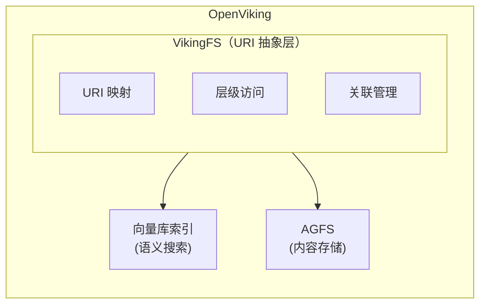
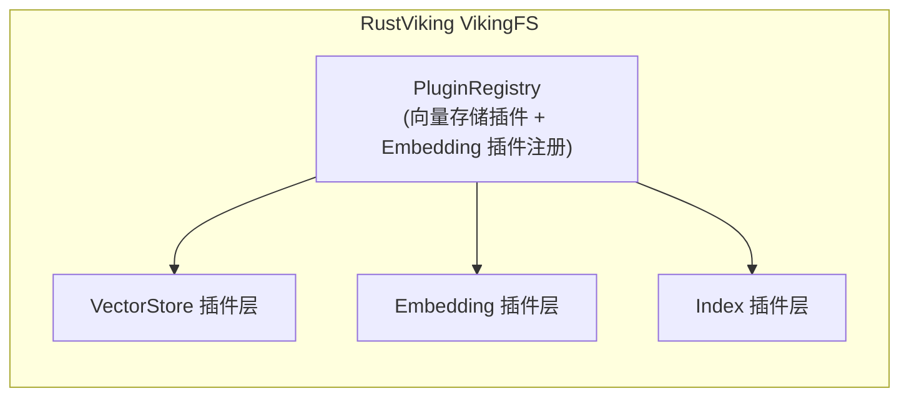
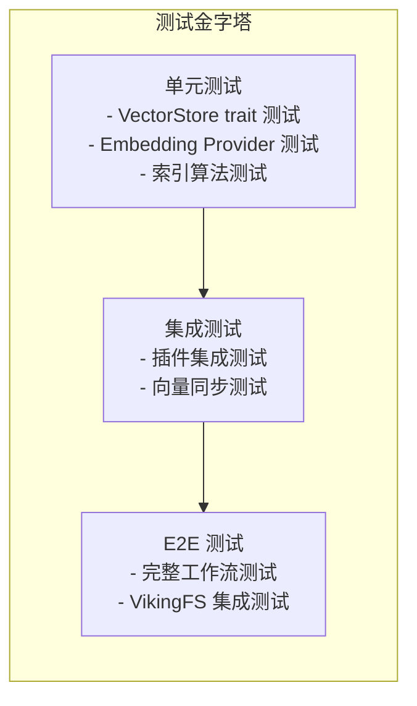

# RustViking 向量存储与索引架构对齐设计文档

## 一、项目背景与目标

### 1.1 项目概述

RustViking 是 OpenViking 核心引擎的 Rust 实现，旨在为 AI Agent 提供高性能的上下文数据库能力。项目采用文件系统范式（Filesystem Paradigm）统一管理 Agent 所需的记忆（Memories）、资源（Resources）和技能（Skills）。

### 1.2 本文档目的

本文档旨在分析 OpenViking 的向量存储与索引架构，明确 RustViking 当前实现与目标架构的差距，并提出插件化的设计方案，以便团队其他成员能够接手后续开发工作。

### 1.3 对齐目标

1. **架构对齐**：保持与 OpenViking 相同的双层存储架构（AGFS + 向量库）
2. **插件化设计**：对于使用外部服务的部分，引入开源组件作为插件
3. **性能优化**：确保本地向量索引的高性能实现
4. **测试完善**：建立完整的测试和 Benchmark 体系

---

## 二、OpenViking 架构分析

### 2.1 整体架构



### 2.2 双层存储架构

| 存储层 | 职责 | 存储内容 |
|--------|------|----------|
| **AGFS** | 内容存储 | L0/L1/L2 完整内容、多媒体文件、关联关系 |
| **向量库** | 索引存储 | URI、向量、元数据（不存文件内容） |

**设计优势：**
- 职责清晰：向量库只负责检索，AGFS 负责存储
- 内存优化：向量库不存储文件内容，节省内存
- 单一数据源：所有内容从 AGFS 读取，向量库只存引用
- 独立扩展：向量库和 AGFS 可分别扩展

### 2.3 向量库索引实现

OpenViking 向量库支持多种后端：

| 后端类型 | 说明 | 适用场景 |
|----------|------|----------|
| `local` | 本地持久化 | 开发测试、轻量级部署 |
| `http` | HTTP 远程服务 | 连接远程向量服务 |
| `volcengine` | 火山引擎 VikingDB | 生产环境、高可用 |

#### Context 集合 Schema

```json
{
  "id": "string",           // 主键
  "uri": "string",          // 资源 URI
  "parent_uri": "string",   // 父目录 URI
  "context_type": "string", // resource/memory/skill
  "is_leaf": "boolean",      // 是否叶子节点
  "vector": "vector",        // 密集向量
  "sparse_vector": "sparse_vector", // 稀疏向量
  "abstract": "string",      // L0 摘要文本
  "name": "string",          // 名称
  "description": "string",   // 描述
  "created_at": "string",    // 创建时间
  "active_count": "int64"    // 使用次数
}
```

#### 索引配置

```json
{
  "IndexType": "flat_hybrid",  // 混合索引类型
  "Distance": "cosine",        // 距离度量
  "Quant": "int8"              // 量化方式
}
```

### 2.4 Embedding Provider 架构

OpenViking 支持多种 Embedding Provider：

| Provider | 说明 | 状态 |
|----------|------|------|
| `volcengine` | 火山引擎 Doubao Embedding | 官方支持 |
| `openai` | OpenAI Embedding API | 官方支持 |
| `jina` | Jina AI Embedding | 官方支持 |
| `voyage` | Voyage AI | 官方支持 |
| `minimax` | MiniMax Embedding | 官方支持 |
| `vikingdb` | VikingDB Embedding | 官方支持 |
| `gemini` | Google Gemini | 官方支持 |

#### 配置示例

```json
{
  "embedding": {
    "dense": {
      "api_base": "<api-endpoint>",
      "api_key": "<your-api-key>",
      "provider": "<provider-type>",
      "dimension": 1024,
      "model": "<model-name>"
    },
    "max_concurrent": 10
  }
}
```

### 2.5 向量同步机制

VikingFS 自动维护向量库与 AGFS 的一致性：

- **删除同步**：删除文件时递归删除向量库中所有相关记录
- **移动同步**：移动/重命名时自动更新向量库中的 URI 和 parent_uri 字段

---

## 三、RustViking 当前实现

### 3.1 项目结构

```
rustviking/
├── src/
│   ├── agfs/              # 文件系统抽象层 ✅ 已实现
│   ├── cli/               # CLI 命令
│   ├── compute/           # 计算模块
│   │   ├── distance.rs   # 距离计算
│   │   ├── normalize.rs   # 向量归一化
│   │   └── simd.rs        # SIMD 优化（理论）
│   ├── config/            # 配置加载
│   ├── index/             # 向量索引层 ⚠️ 待完善
│   │   ├── vector.rs      # VectorIndex trait
│   │   ├── hnsw.rs        # HNSW 实现
│   │   ├── ivf_pq.rs      # IVF-PQ 实现
│   │   ├── layered.rs     # 分层索引
│   │   └── bitmap.rs      # Bitmap 操作
│   ├── plugins/           # 存储插件 ✅ 已插件化
│   │   ├── memory.rs      # 内存存储
│   │   └── localfs.rs     # 本地文件系统
│   ├── storage/           # 键值存储
│   └── main.rs
├── benches/               # 基准测试
└── tests/                 # 单元测试
```

### 3.2 当前 VectorIndex Trait

```rust
// src/index/vector.rs
pub trait VectorIndex: Send + Sync {
    fn insert(&self, id: u64, vector: &[f32], level: u8) -> Result<()>;
    fn insert_batch(&self, vectors: &[(u64, Vec<f32>, u8)]) -> Result<()>;
    fn search(&self, query: &[f32], k: usize, level_filter: Option<u8>) -> Result<Vec<SearchResult>>;
    fn delete(&self, id: u64) -> Result<()>;
    fn get(&self, id: u64) -> Result<Option<Vec<f32>>>;
    fn count(&self) -> u64;
    fn dimension(&self) -> usize;
}
```

### 3.3 当前索引实现

#### 3.3.1 IVF-PQ Index (ivf_pq.rs)

```rust
pub struct IvfPqIndex {
    params: IvfPqParams,
    dimension: usize,
    centroids: RwLock<Vec<Vec<f32>>>,      // K 个质心
    partitions: RwLock<Vec<PartitionData>>, // 分区数据
    computer: DistanceComputer,
    trained: RwLock<bool>,
}
```

**特点：**
- 支持 K-Means 训练
- nprobe 搜索策略
- 支持 level_filter 过滤

#### 3.3.2 HNSW Index (hnsw.rs)

```rust
pub struct HnswIndex {
    params: HnswParams,
    dimension: usize,
    nodes: RwLock<HashMap<u64, HnswNode>>,
    entry_point: RwLock<Option<u64>>,
    max_layer: RwLock<usize>,
    computer: DistanceComputer,
}
```

**特点：**
- 简化版 HNSW（使用贪婪搜索，非完整层级遍历）
- RwLock 保护并发访问

### 3.4 当前距离计算 (distance.rs)

```rust
impl DistanceComputer {
    pub fn l2_distance(&self, a: &[f32], b: &[f32]) -> f32 {
        a.iter().zip(b.iter())
          .map(|(x, y)| { let diff = x - y; diff * diff })
          .sum()
    }
    
    pub fn dot_product(&self, a: &[f32], b: &[f32]) -> f32 {
        a.iter().zip(b.iter()).map(|(x, y)| x * y).sum()
    }
    
    pub fn cosine_distance(&self, a: &[f32], b: &[f32]) -> f32 {
        // 1 - cosine_similarity
    }
}
```

**问题：**
- 无 SIMD 优化
- 纯 Rust 迭代器实现

### 3.5 当前 Benchmark 状态

| 测试类型 | 规模 | 说明 |
|----------|------|------|
| `vector_insert` | 100-1000 vectors | 小规模测试 |
| `vector_insert_batch` | 100 vectors/batch | 批量插入 |
| `vector_search` | k=1,10,50 | 搜索测试 |
| `vector_search_with_filter` | 1000 vectors | 带层级过滤 |
| `vector_get` | 1000 vectors | ID 查询 |

---

## 四、差距分析

### 4.1 功能差距

| 功能模块 | OpenViking | RustViking | 差距 |
|----------|------------|------------|------|
| **向量存储后端** | local/http/VikingDB 插件 | ❌ 无插件化 | 🔴 重大 |
| **Embedding Provider** | 多 Provider 支持 | ❌ 未实现 | 🔴 重大 |
| **Sparse Vector** | 支持 | ❌ 未实现 | 🟡 中等 |
| **向量同步机制** | 自动同步 | ❌ 未实现 | 🔴 重大 |
| **IndexType 配置** | flat_hybrid 等 | ❌ 仅本地索引 | 🟡 中等 |

### 4.2 性能差距

| 指标 | OpenViking | RustViking | 差距 |
|------|------------|------------|------|
| **数据规模测试** | 百万/亿级 | ~1000 | 🔴 重大 |
| **SIMD 优化** | 使用 | ❌ 无 | 🔴 重大 |
| **批量操作** | 支持 | 部分 | 🟡 中等 |
| **持久化存储** | RocksDB/SQLite | 仅内存 | 🟡 中等 |

### 4.3 架构差距

```
OpenViking:
┌─────────────────────────────────────────┐
│         VikingFS (Python + Go)          │
│  ├── VectorStore (插件化) ────> 外部服务 │
│  └── AGFS (Go 实现)                      │
└─────────────────────────────────────────┘

RustViking:
┌─────────────────────────────────────────┐
│         VikingFS (Rust)                  │
│  ├── VectorIndex (本地实现) ────> ❌    │
│  └── AGFS (本地实现) ✅                   │
└─────────────────────────────────────────┘
```

---

## 五、开源组件评估

### 5.1 向量数据库/索引开源方案

| 组件 | 语言 | License | 集成复杂度 | 推荐度 | 说明 |
|------|------|---------|------------|--------|------|
| **Qdrant** | Rust | Apache 2.0 | 中 | ⭐⭐⭐⭐⭐ | 高性能向量数据库，支持 HNSW，有成熟 Rust SDK |
| **Meilisearch** | Rust | MIT | 低 | ⭐⭐⭐⭐ | 全文+向量搜索，集成简单 |
| **Milvus** | Go | Apache 2.0 | 高 | ⭐⭐⭐ | 成熟但集成复杂 |
| **Chroma** | Python | Apache 2.0 | 低 | ⭐⭐⭐ | 轻量级，主要 Python |
| **LanceDB** | Rust | Apache 2.0 | 中 | ⭐⭐⭐⭐ | Rust 原生，磁盘持久化 |
| **USearch** | C++ | Apache 2.0 | 低 | ⭐⭐⭐⭐ | 极致性能，单头文件 |
| **pgvector** | C | PostgreSQL | 中 | ⭐⭐⭐ | PostgreSQL 扩展 |
| **Faiss** | C++ | Apache 2.0 | 高 | ⭐⭐⭐⭐ | Meta 出品，算法丰富 |
| **Annoy** | C++/Python | Apache 2.0 | 中 | ⭐⭐⭐ | Spotify 出品，内存映射 |

### 5.2 Embedding 开源方案

| 组件 | License | 本地运行 | 说明 |
|------|---------|----------|------|
| **Ollama** | MIT | ✅ | 本地 LLM 服务，支持 Embedding |
| **Sentence Transformers** | Apache 2.0 | ✅ | Python，需要 PyTorch |
| **Transformers (HuggingFace)** | Apache 2.0 | ✅ | 通用的 Embedding 模型 |
| **FastEmbed** | Apache 2.0 | ✅ | Qdrant 出品，Rust 实现 |
| **Xinference** | Apache 2.0 | ✅ | 支持多种模型 |

### 5.3 推荐集成方案

#### 方案 A：Qdrant 作为向量存储后端（推荐）

**优点：**
- Rust 原生，性能优秀
- 支持 HNSW、IVF 等多种索引
- 有成熟 HTTP/GRPC API
- 支持分布式部署
- 内置稀疏向量支持

**集成方式：**
```rust
// Qdrant HTTP API 调用
use reqwest;

pub struct QdrantPlugin {
    base_url: String,
    collection: String,
}

impl VectorStore for QdrantPlugin {
    fn insert(&self, id: &str, vector: &[f32], payload: Value) -> Result<()>;
    fn search(&self, query: &[f32], k: usize) -> Result<Vec<SearchResult>>;
    fn upsert(&self, points: Vec<Point>) -> Result<()>;
}
```

#### 方案 B：LanceDB 作为本地向量存储

**优点：**
- Rust 原生
- 支持磁盘持久化
- 无外部依赖
- 支持向量 + 关系数据

#### 方案 C：USearch 作为高性能索引

**优点：**
- 单头文件 C++ 库
- 极致性能
- 支持 SIMD
- 支持 Rust 绑定

---

## 六、插件化设计方案

### 6.1 整体架构



### 6.2 VectorStore Trait 设计

```rust
// src/vector_store/trait.rs

use crate::error::Result;
use serde::{Deserialize, Serialize};
use std::collections::HashMap;

/// 向量记录元数据
#[derive(Debug, Clone, Serialize, Deserialize)]
pub struct VectorMetadata {
    pub id: String,
    pub uri: String,
    pub parent_uri: Option<String>,
    pub context_type: String,       // resource/memory/skill
    pub is_leaf: bool,
    pub level: u8,                   // L0/L1/L2
    pub abstract_text: Option<String>,
    pub name: Option<String>,
    pub description: Option<String>,
    pub created_at: String,
    pub active_count: i64,
}

/// 搜索结果
#[derive(Debug, Clone)]
pub struct VectorSearchResult {
    pub id: String,
    pub score: f32,
    pub metadata: VectorMetadata,
}

/// 向量存储插件 Trait
pub trait VectorStore: Send + Sync {
    /// 插件名称
    fn name(&self) -> &str;
    
    /// 插件版本
    fn version(&self) -> &str;
    
    /// 初始化
    fn initialize(&self, config: &Value) -> Result<()>;
    
    /// 创建集合
    fn create_collection(&self, name: &str, dimension: usize, params: IndexParams) -> Result<()>;
    
    /// 插入向量
    fn upsert(&self, collection: &str, points: Vec<VectorPoint>) -> Result<()>;
    
    /// 搜索向量
    fn search(
        &self,
        collection: &str,
        query: &[f32],
        k: usize,
        filters: Option<Filter>,
    ) -> Result<Vec<VectorSearchResult>>;
    
    /// 获取向量
    fn get(&self, collection: &str, id: &str) -> Result<Option<VectorPoint>>;
    
    /// 删除向量
    fn delete(&self, collection: &str, id: &str) -> Result<()>;
    
    /// 按 URI 前缀删除（用于向量同步）
    fn delete_by_uri_prefix(&self, collection: &str, uri_prefix: &str) -> Result<()>;
    
    /// 更新 URI（用于向量同步）
    fn update_uri(&self, collection: &str, old_uri: &str, new_uri: &str) -> Result<()>;
    
    /// 获取集合信息
    fn collection_info(&self, collection: &str) -> Result<CollectionInfo>;
}

/// 向量点
#[derive(Debug, Clone, Serialize, Deserialize)]
pub struct VectorPoint {
    pub id: String,
    pub vector: Vec<f32>,
    pub sparse_vector: Option<HashMap<usize, f32>>,  // 稀疏向量
    pub payload: Value,                                 // 元数据 JSON
}

/// 索引参数
#[derive(Debug, Clone)]
pub struct IndexParams {
    pub index_type: IndexType,     // HNSW, IVF, FLAT, etc.
    pub distance: DistanceType,    // Cosine, L2, DotProduct
    pub quantization: Option<QuantizationType>,
    
    // HNSW 参数
    pub m: Option<usize>,           // Max connections
    pub ef_construction: Option<usize>,
    pub ef_search: Option<usize>,
    
    // IVF 参数
    pub num_partitions: Option<usize>,
    pub nprobe: Option<usize>,
}

/// 索引类型
#[derive(Debug, Clone, Copy)]
pub enum IndexType {
    Flat,
    Hnsw,
    Ivf,
    FlatHybrid,
}

/// 距离类型
#[derive(Debug, Clone, Copy)]
pub enum DistanceType {
    Cosine,
    L2,
    DotProduct,
}

/// 量化类型
#[derive(Debug, Clone, Copy)]
pub enum QuantizationType {
    Int8,
    Int16,
    Binary,
}
```

### 6.3 EmbeddingProvider Trait 设计

```rust
// src/embedding/trait.rs

use crate::error::Result;

/// Embedding 结果
#[derive(Debug, Clone)]
pub struct EmbeddingResult {
    pub embeddings: Vec<Vec<f32>>,
    pub model: String,
    pub dimension: usize,
    pub token_count: Option<usize>,
}

/// Embedding 请求
#[derive(Debug, Clone)]
pub struct EmbeddingRequest {
    pub texts: Vec<String>,
    pub model: Option<String>,
    pub normalize: bool,           // 是否归一化
}

/// Embedding Provider Trait
pub trait EmbeddingProvider: Send + Sync {
    /// Provider 名称
    fn name(&self) -> &str;
    
    /// Provider 版本
    fn version(&self) -> &str;
    
    /// 初始化
    fn initialize(&self, config: EmbeddingConfig) -> Result<()>;
    
    /// 生成 Embedding
    fn embed(&self, request: EmbeddingRequest) -> Result<EmbeddingResult>;
    
    /// 批量生成 Embedding（支持并发）
    fn embed_batch(&self, requests: Vec<EmbeddingRequest>, max_concurrent: usize) -> Result<Vec<EmbeddingResult>>;
    
    /// 获取默认维度
    fn default_dimension(&self) -> usize;
    
    /// 获取支持的模型列表
    fn supported_models(&self) -> Vec<&str>;
}

/// Embedding 配置
#[derive(Debug, Clone)]
pub struct EmbeddingConfig {
    pub api_base: String,
    pub api_key: Option<String>,
    pub provider: String,          // openai, volcengine, ollama, etc.
    pub model: String,
    pub dimension: usize,
    pub max_concurrent: usize,
}
```

### 6.4 插件注册机制

```rust
// src/plugin/registry.rs

use std::collections::HashMap;

/// 插件类型
pub enum PluginType {
    VectorStore,
    Embedding,
}

/// 插件元信息
pub struct PluginInfo {
    pub name: String,
    pub version: String,
    pub plugin_type: PluginType,
    pub description: String,
}

/// 全局插件注册表
pub struct PluginRegistry {
    vector_stores: HashMap<String, Box<dyn Fn() -> Box<dyn VectorStore>>>,
    embedding_providers: HashMap<String, Box<dyn Fn() -> Box<dyn EmbeddingProvider>>>,
}

impl PluginRegistry {
    pub fn new() -> Self;
    
    /// 注册向量存储插件
    pub fn register_vector_store<F>(&mut self, name: &str, factory: F) 
    where F: Fn() -> Box<dyn VectorStore> + Send + Sync + 'static;
    
    /// 注册 Embedding 插件
    pub fn register_embedding_provider<F>(&mut self, name: &str, factory: F)
    where F: Fn() -> Box<dyn EmbeddingProvider> + Send + Sync + 'static;
    
    /// 创建向量存储实例
    pub fn create_vector_store(&self, name: &str) -> Result<Box<dyn VectorStore>>;
    
    /// 创建 Embedding Provider 实例
    pub fn create_embedding_provider(&self, name: &str) -> Result<Box<dyn EmbeddingProvider>>;
    
    /// 列出已注册的插件
    pub fn list_plugins(&self) -> Vec<PluginInfo>;
}
```

---

## 七、插件实现清单

### 7.1 向量存储插件

| 插件名称 | 类型 | 依赖 | 优先级 | 说明 |
|----------|------|------|--------|------|
| `memory` | 本地测试 | 无 | 🔴 必须 | 内存向量存储，用于开发测试 |
| `localfile` | 本地持久化 | 无 | 🔴 必须 | 文件-based 持久化 |
| `qdrant` | 外部服务 | qdrant-client | 🔴 高 | Qdrant 向量数据库集成 |
| `lance` | 本地持久化 | lancedb | 🟡 中 | LanceDB 集成 |
| `usearch` | 本地索引 | usearch | 🟡 中 | USearch 高性能索引 |
| `http` | 通用远程 | reqwest | 🟡 中 | HTTP API 通用客户端 |

### 7.2 Embedding 插件

| 插件名称 | 类型 | 依赖 | 优先级 | 说明 |
|----------|------|------|--------|------|
| `openai` | 外部服务 | reqwest | 🔴 高 | OpenAI Embedding API |
| `ollama` | 本地服务 | reqwest | 🔴 高 | Ollama 本地 Embedding |
| `volcengine` | 外部服务 | reqwest | 🟡 中 | 火山引擎 Doubao Embedding |
| `fake` | 本地测试 | 无 | 🔴 必须 | 假数据 Embedding，用于测试 |

### 7.3 索引插件（可选）

如果外部向量存储不支持某些索引，可以实现本地索引插件：

| 插件名称 | 类型 | 优先级 | 说明 |
|----------|------|--------|------|
| `hnsw` | 本地 | 🟡 中 | HNSW 索引实现 |
| `ivf-pq` | 本地 | 🟡 中 | IVF-PQ 索引实现 |
| `flat` | 本地 | 🟡 中 | 暴力搜索索引 |

---

## 八、实施计划

### 8.1 阶段一：核心架构（2 周）

**目标：** 建立插件化基础框架

| 任务 | 工作量 | 依赖 | 产出 |
|------|--------|------|------|
| VectorStore trait 定义 | 2 天 | 无 | `src/vector_store/trait.rs` |
| EmbeddingProvider trait 定义 | 2 天 | 无 | `src/embedding/trait.rs` |
| PluginRegistry 泛化 | 2 天 | 无 | 支持多种插件类型 |
| MemoryVectorStore 测试插件 | 2 天 | VectorStore trait | `src/vector_store/memory.rs` |
| FakeEmbedding 测试插件 | 1 天 | EmbeddingProvider trait | `src/embedding/fake.rs` |
| 配置文件结构设计 | 1 天 | 无 | TOML 配置结构 |

### 8.2 阶段二：本地存储插件（2 周）

**目标：** 实现本地持久化向量存储

| 任务 | 工作量 | 依赖 | 产出 |
|------|--------|------|------|
| LocalFileVectorStore 实现 | 3 天 | VectorStore trait | `src/vector_store/localfile.rs` |
| SQLite 向量存储实现 | 3 天 | VectorStore trait | `src/vector_store/sqlite.rs` |
| 向量同步机制实现 | 2 天 | VectorStore | delete_by_uri_prefix, update_uri |
| 本地插件单元测试 | 2 天 | 上述实现 | 完整测试覆盖 |

### 8.3 阶段三：外部服务集成（2 周）

**目标：** 集成 Qdrant 等外部向量数据库

| 任务 | 工作量 | 依赖 | 产出 |
|------|--------|------|------|
| Qdrant HTTP Client | 3 天 | VectorStore trait | `src/vector_store/qdrant.rs` |
| Qdrant 插件测试 | 2 天 | Qdrant Client | 集成测试 |
| OpenAI Embedding Provider | 2 天 | EmbeddingProvider trait | `src/embedding/openai.rs` |
| Ollama Embedding Provider | 2 天 | EmbeddingProvider trait | `src/embedding/ollama.rs` |

### 8.4 阶段四：性能优化（2 周）

**目标：** 提升向量计算和索引性能

| 任务 | 工作量 | 依赖 | 产出 |
|------|--------|------|------|
| SIMD 距离计算优化 | 3 天 | 无 | `src/compute/simd.rs` 实际使用 |
| 批量操作优化 | 2 天 | SIMD | 批量插入/搜索优化 |
| 并发搜索优化 | 2 天 | SIMD | 多线程搜索 |

### 8.5 阶段五：测试与 Benchmark（1 周）

**目标：** 建立完善的测试体系

| 任务 | 工作量 | 依赖 | 产出 |
|------|--------|------|------|
| 百万级向量 Benchmark | 2 天 | LocalFileVectorStore | `benches/vector_scale_bench.rs` |
| Embedding Benchmark | 1 天 | Fake/OpenAI Provider | `benches/embedding_bench.rs` |
| 插件集成测试 | 1 天 | Qdrant 插件 | `tests/plugin_integration.rs` |
| 性能对比报告 | 1 天 | 上述所有 | Markdown 报告 |

---

## 九、测试与 Benchmark 设计

### 9.1 测试分层



### 9.2 单元测试清单

#### VectorStore Trait 测试

```rust
#[cfg(test)]
mod vector_store_tests {
    // 1. 插入测试
    #[test]
    fn test_insert_single_vector() {
        // 测试单个向量插入
    }
    
    // 2. 批量插入测试
    #[test]
    fn test_batch_insert() {
        // 测试批量向量插入
    }
    
    // 3. 搜索测试
    #[test]
    fn test_search_basic() {
        // 测试基本搜索功能
    }
    
    // 4. 过滤测试
    #[test]
    fn test_search_with_filter() {
        // 测试 metadata 过滤
    }
    
    // 5. 删除测试
    #[test]
    fn test_delete() {
        // 测试向量删除
    }
    
    // 6. URI 前缀删除测试
    #[test]
    fn test_delete_by_uri_prefix() {
        // 测试向量同步删除
    }
    
    // 7. URI 更新测试
    #[test]
    fn test_update_uri() {
        // 测试向量同步更新
    }
}
```

#### Embedding Provider 测试

```rust
#[cfg(test)]
mod embedding_provider_tests {
    // 1. 基本 Embedding 测试
    #[test]
    fn test_basic_embedding() {
        // 测试文本向量化
    }
    
    // 2. 批量 Embedding 测试
    #[test]
    fn test_batch_embedding() {
        // 测试批量文本向量化
    }
    
    // 3. 并发 Embedding 测试
    #[test]
    fn test_concurrent_embedding() {
        // 测试并发请求
    }
    
    // 4. 维度验证测试
    #[test]
    fn test_dimension_validation() {
        // 验证返回向量维度
    }
}
```

### 9.3 Benchmark 设计

#### 9.3.1 向量存储 Benchmark

```rust
// benches/vector_store_bench.rs

use criterion::{criterion_group, criterion_main, Criterion, BenchmarkId};
use rustviking::vector_store::{VectorStore, VectorPoint};
use rustviking::plugins::memory_vector_store::MemoryVectorStore;

fn bench_insert(c: &mut Criterion) {
    let store = MemoryVectorStore::new();
    
    // 小规模插入
    for size in [100, 1000, 10000].iter() {
        // ...
    }
}

fn bench_search(c: &mut Criterion) {
    // 小规模搜索
    for size in [1000, 10000, 100000].iter() {
        // ...
    }
}

fn bench_scale(c: &mut Criterion) {
    // 百万级测试
    for size in [1_000_000, 10_000_000].iter() {
        // ...
    }
}

criterion_group!(
    vector_store_benches,
    bench_insert,
    bench_search,
    bench_scale
);
criterion_main!(vector_store_benches);
```

#### 9.3.2 Embedding Benchmark

```rust
// benches/embedding_bench.rs

fn bench_embedding_latency(c: &mut Criterion) {
    let provider = FakeEmbeddingProvider::new(1024);
    
    c.bench_function("single_text_embedding", |b| {
        b.iter(|| {
            provider.embed(EmbeddingRequest {
                texts: vec!["This is a test sentence.".to_string()],
                model: None,
                normalize: true,
            })
        })
    });
}

fn bench_embedding_throughput(c: &mut Criterion) {
    let provider = FakeEmbeddingProvider::new(1024);
    
    c.bench_function("batch_100_embedding", |b| {
        b.iter(|| {
            let texts: Vec<String> = (0..100)
                .map(|i| format!("Test sentence number {}", i))
                .collect();
            provider.embed(EmbeddingRequest {
                texts,
                model: None,
                normalize: true,
            })
        })
    });
}
```

#### 9.3.3 Embedding Mock 实现（用于测试对齐）

由于没有真实 Embedding 模型，需要实现一个 Mock Provider：

```rust
// src/embedding/mock.rs

/// Mock Embedding Provider - 用于测试和 Benchmark
/// 
/// 实现说明：
/// - 生成确定性的假向量（基于文本 hash）
/// - 保持与真实 API 的接口一致性
/// - 支持配置向量维度
pub struct MockEmbeddingProvider {
    dimension: usize,
}

impl MockEmbeddingProvider {
    pub fn new(dimension: usize) -> Self {
        Self { dimension }
    }
    
    /// 生成确定性向量
    /// 相同文本生成相同向量，用于测试可重复性
    fn generate_deterministic_vector(&self, text: &str) -> Vec<f32> {
        use std::collections::hash_map::DefaultHasher;
        use std::hash::{Hash, Hasher};
        
        let mut hasher = DefaultHasher::new();
        text.hash(&mut hasher);
        let hash = hasher.finish();
        
        let mut rng = SimpleRng::new(hash);
        (0..self.dimension)
            .map(|_| rng.next_f32())
            .collect()
    }
}
```

### 9.4 性能指标收集

| 指标 | 说明 | 目标 |
|------|------|------|
| `insert_throughput` | 向量插入吞吐 (vectors/sec) | > 100,000/sec |
| `search_latency_p50` | 搜索延迟 P50 | < 10ms |
| `search_latency_p99` | 搜索延迟 P99 | < 50ms |
| `embedding_latency` | 单条 Embedding 延迟 | < 100ms |
| `memory_usage` | 内存占用 | < 2GB / 1M vectors |

---

## 十、配置设计

### 10.1 配置文件结构

```toml
# config.toml

[storage]
workspace = "/path/to/workspace"

[vector_store]
# 选择向量存储插件
plugin = "memory"  # memory, localfile, qdrant, http

[vector_store.plugins.memory]
# Memory 插件无需配置

[vector_store.plugins.localfile]
path = "/path/to/vector_data"

[vector_store.plugins.qdrant]
url = "http://localhost:6333"
collection = "rustviking"
timeout_ms = 5000

[embedding]
# 选择 Embedding Provider
plugin = "openai"  # openai, ollama, volcengine, mock

[embedding.plugins.openai]
api_base = "https://api.openai.com/v1"
api_key = "sk-..."
model = "text-embedding-3-small"
dimension = 1536
max_concurrent = 10

[embedding.plugins.ollama]
url = "http://localhost:11434"
model = "nomic-embed-text"
dimension = 768
max_concurrent = 5

[embedding.plugins.mock]
dimension = 1024

[index]
# 默认索引参数
default_index_type = "hnsw"
default_distance = "cosine"
hnsw.m = 16
hnsw.ef_construction = 200
hnsw.ef_search = 50
```

---

## 十一、风险与注意事项

### 11.1 技术风险

| 风险 | 影响 | 缓解措施 |
|------|------|----------|
| Qdrant 集成复杂度 | 中 | 先实现 Memory 插件验证架构 |
| SIMD 优化兼容性 | 高 | 使用 portable_simd 或条件编译 |
| 外部 API 稳定性 | 中 | 实现重试和降级机制 |

### 11.2 注意事项

1. **插件隔离**：每个插件应独立编译，避免依赖冲突
2. **错误处理**：统一错误类型，便于调试
3. **日志记录**：关键操作需要 trace 日志
4. **配置验证**：启动时验证配置合法性

---

## 十二、附录

### 12.1 参考资料

- [OpenViking GitHub](https://github.com/volcengine/OpenViking)
- [Qdrant Documentation](https://qdrant.tech/documentation/)
- [LanceDB Documentation](https://lancedb.github.io/lancedb/)
- [USearch GitHub](https://github.com/unum-cloud/usearch)

### 12.2 术语表

| 术语 | 说明 |
|------|------|
| AGFS | Agent File System，向量数据库的文件系统抽象层 |
| Vector Store | 向量存储，负责向量和元数据的持久化 |
| Embedding | 将文本转换为向量表示 |
| HNSW | Hierarchical Navigable Small World，高性能近似最近邻算法 |
| IVF-PQ | Inverted File with Product Quantization，倒排索引+乘积量化 |
| SIMD | Single Instruction Multiple Data，单指令多数据 |

### 12.3 联系人

- **项目 Owner**: SpellingDragon
- **文档维护**: [团队成员]
- **最后更新**: 2025年

---

*本文档为技术设计文档，用于指导 RustViking 向量存储与索引模块的开发和实现。*
